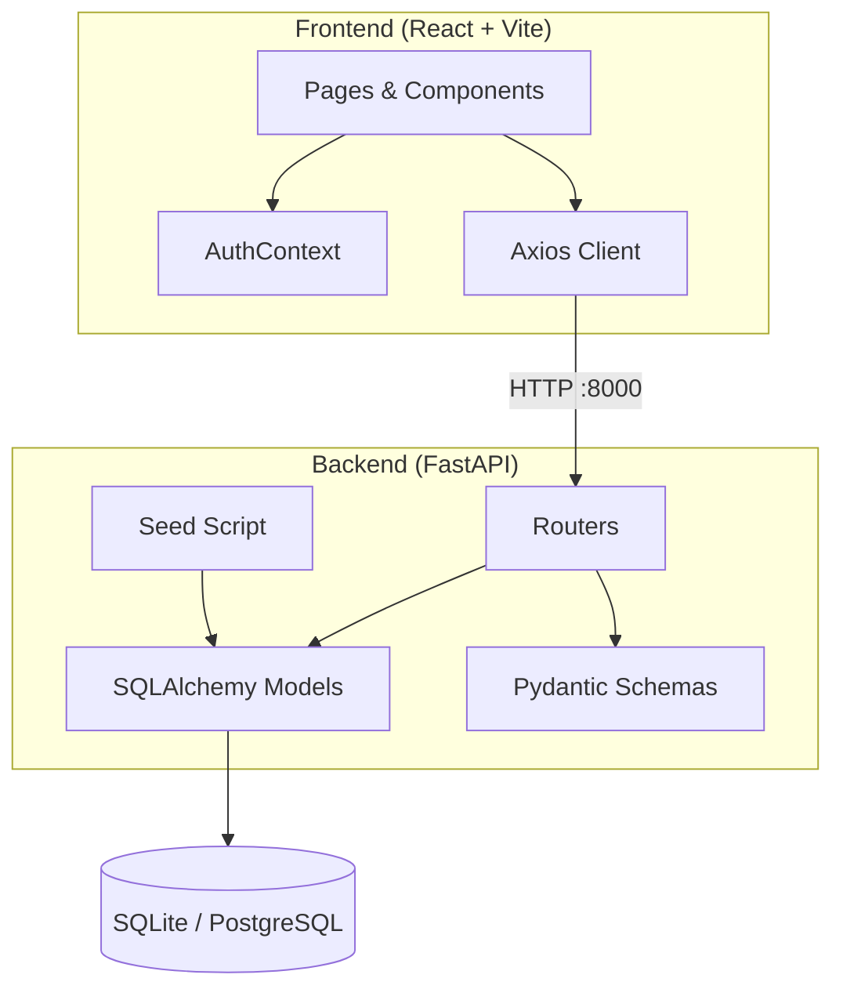
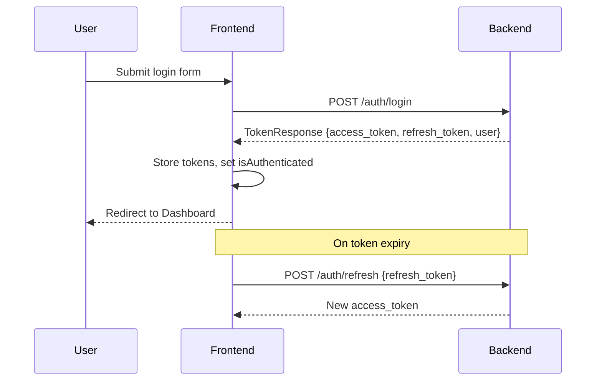
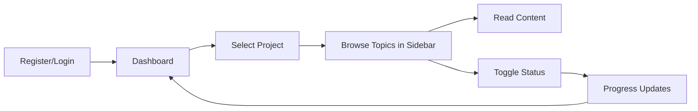
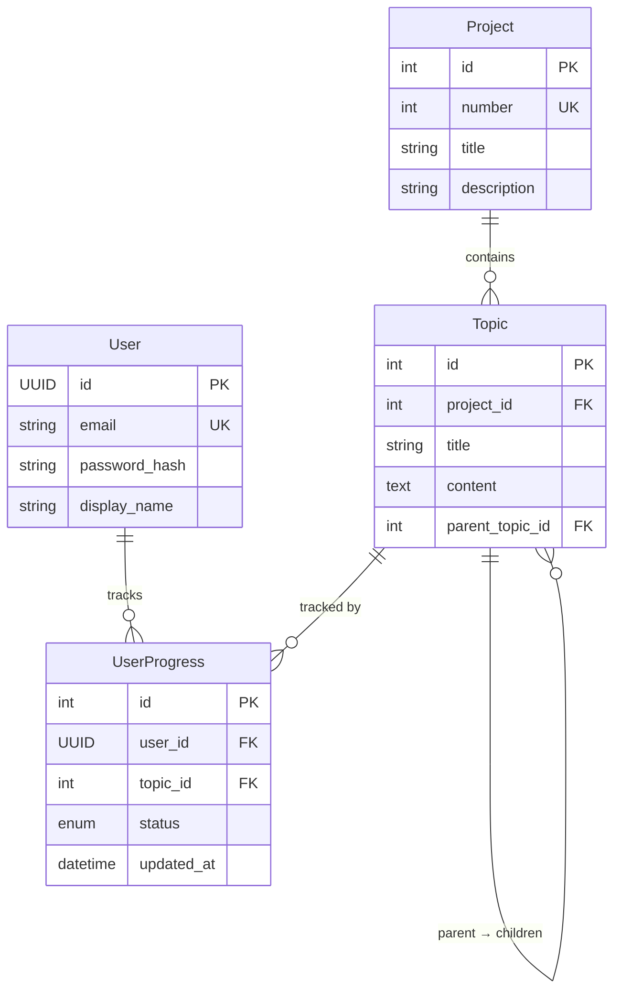

# AI Learning Progress Tracker

Full-stack web app for tracking progress through the AI curriculum (Projects 1–5 + Capstone) with rich inline learning content.

## Tech Stack

- **Backend**: Python 3.11+ / FastAPI / async SQLAlchemy / SQLite (dev) / PostgreSQL (prod)
- **Frontend**: React 18 / Vite / Tailwind CSS / Lucide icons / react-markdown + remark-gfm
- **Auth**: JWT (access 30 min + refresh 7 days) via python-jose + passlib/bcrypt

## Architecture

## Auth Flow

## User Workflow

## Core Features

1. **Authentication** — Register/login with JWT. Responses MUST include user object in `TokenResponse`.
2. **Dashboard** — Project cards with progress bars, overall completion %, streak counter.
3. **Topic Progress** — Tree of topics/sub-topics. Status cycle: Not Started → In Progress → Completed.
4. **Topic Content** — Every topic has 200–500 words of markdown content. Split-panel layout (see `docs/ui-decisions.md`).
5. **Progress Summary** — Dashboard header with overall % and per-project breakdown.

## Data Model

### Schema Rules
- `TopicResponse` uses `children` (not `sub_topics`)
- `ProjectListItem` uses `progress_percentage` (not `percentage`)
- `GET /projects/{id}/topics` returns `ProjectDetailResponse` object — access `.data.topics`
- All models: `model_config = {"from_attributes": True}`

## API Endpoints

| Method | Path | Auth | Returns |
|--------|------|------|---------|
| POST | `/auth/register` | No | TokenResponse (with user) |
| POST | `/auth/login` | No | TokenResponse (with user) |
| POST | `/auth/refresh` | No | AccessTokenResponse |
| GET | `/projects` | Yes | ProjectListItem[] |
| GET | `/projects/{id}/topics` | Yes | ProjectDetailResponse |
| GET | `/projects/topics/{topic_id}` | Yes | TopicResponse |
| PATCH | `/progress/{topic_id}` | Yes | ProgressResponse |
| GET | `/dashboard` | Yes | DashboardResponse |

## Routes

`/login` · `/register` · `/` (dashboard) · `/projects/:id` · `/profile` — all protected except auth pages.

## Seeding

`python -m app.seed` — Creates projects, topics with hierarchy, populates `content`. Idempotent. Content in `app/content/project1.py`–`project6.py`.

## Common Pitfalls

1. **Login not redirecting** — Auth endpoints MUST return user object in TokenResponse.
2. **Topics not displaying** — Use `response.data.topics` not `response.data`.
3. **Field mismatches** — `children` not `sub_topics`, `progress_percentage` not `percentage`.
4. **bcrypt warning** — `'__about__'` AttributeError is harmless.
5. **Rate limiting** — Login: 5/min, Register: 3/min.

## UI Change Tracking ⚠️ MANDATORY

> **Every UI/layout change MUST update `docs/ui-decisions.md` to reflect the current state.**

Before changing any component layout/styling: read `docs/ui-decisions.md`.
After: update the relevant section. No changelog needed — git history tracks that.

## Infrastructure

- Alembic migrations for prod schema changes
- Docker Compose for full stack
- `.env` via pydantic-settings (no hardcoded secrets)
- CORS configured for dev (port 5173 → 8000)
- `run.ps1` script to start both servers

## Testing

- Backend: `pytest` + `httpx.AsyncClient`
- Frontend: React Testing Library
- CI: GitHub Actions (ruff + eslint + tests)