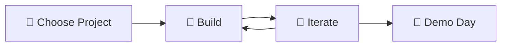
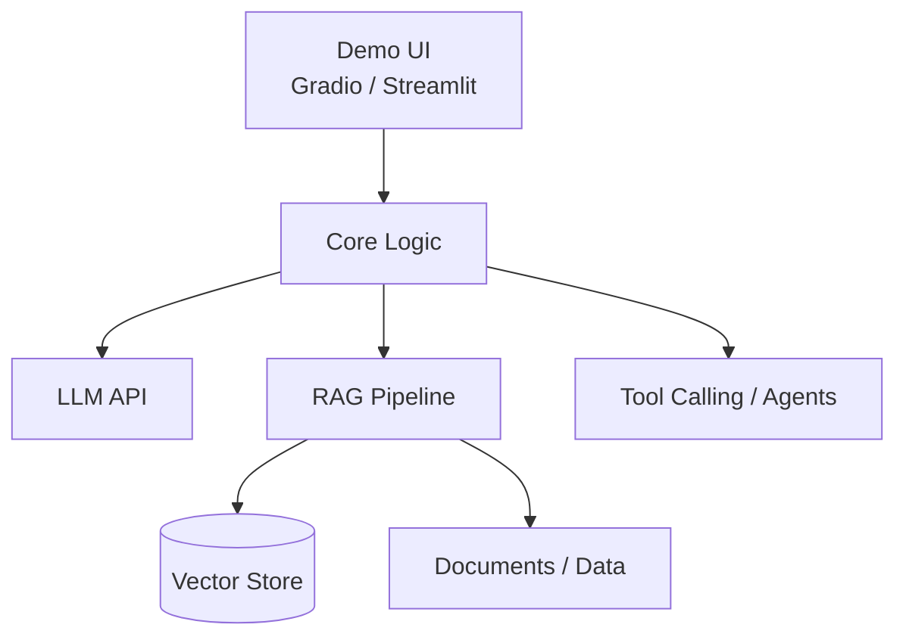

# Capstone Project: Ship a Portfolio-Ready AI Project from Idea to Demo

## Overview

The capstone project is your opportunity to bring together everything you've learned across Projects 1–5 and build something uniquely yours. You'll choose (or invent) an AI project idea, implement it using the techniques from this course, and produce a demo-ready result.

## How It Works



### 1. Choose Your Project

Pick your own idea, or start from one of these suggestions:

| Idea | Key Techniques |
|------|---------------|
| AI-powered code reviewer | RAG + Agents + Tool Calling |
| Personal knowledge assistant | RAG + Prompt Engineering + Web Search |
| Creative story generator with illustrations | LLM + Multimodal Generation |
| Research paper summarizer & Q&A | Deep Research + RAG |
| Multi-modal travel planner | Agents + T2I + Web Search |
| AI tutoring system | LLM + RAG + Chain-of-Thought |
| Automated blog writer with images | Agents + T2I + Web Search |

### 2. Build

Implement your project using techniques from the course:

- **From Project 1**: LLM fundamentals, text generation, parameter tuning
- **From Project 2**: RAG pipelines, embeddings, prompt engineering
- **From Project 3**: Agent architectures, tool calling, ReACT patterns
- **From Project 4**: Reasoning, deep research, iterative search
- **From Project 5**: Image/video generation, multimodal pipelines

### 3. Requirements

Your capstone should include:

- [ ] A clear problem statement and target user
- [ ] Working implementation with clean, documented code
- [ ] A README explaining setup, usage, and architecture
- [ ] At least 2 techniques from different projects
- [ ] Error handling and edge case management
- [ ] A demo script or UI (Gradio/Streamlit recommended)

### 4. Iterate

- Get feedback from peers or instructors as you build
- Iterate on your implementation based on real usage
- Focus on polish: error messages, loading states, edge cases

### 5. Optional: Demo Day

Present your project! Your demo should include:

- **2-minute pitch**: What problem does it solve? Who is it for?
- **Live demo**: Show the happy path + one edge case
- **Architecture overview**: Quick diagram of how components connect
- **Lessons learned**: What was hardest? What would you do differently?



## Project Structure Template

```
capstone/
├── your-project-name/
│   ├── README.md          # Project overview, setup, usage
│   ├── requirements.txt   # Dependencies
│   ├── src/               # Source code
│   │   ├── __init__.py
│   │   ├── main.py        # Entry point
│   │   └── ...
│   ├── data/              # Sample data (if applicable)
│   ├── tests/             # Basic tests
│   └── demo/              # Demo scripts or UI
│       └── app.py         # Gradio/Streamlit app
```

## Evaluation Criteria

| Criteria | Weight | Description |
|----------|--------|-------------|
| Functionality | 30% | Does it work? Does it solve the stated problem? |
| Technical depth | 25% | Appropriate use of AI techniques from the course |
| Code quality | 20% | Clean, documented, well-structured code |
| User experience | 15% | Easy to set up, use, and understand |
| Creativity | 10% | Novel idea or creative application of techniques |

## Getting Started

```bash
# Create your project directory
mkdir capstone/my-project
cd capstone/my-project

# Initialize
python -m venv venv
source venv/bin/activate  # or venv\Scripts\activate on Windows
pip install -r requirements.txt

# Start building!
python src/main.py
```

Good luck! 🚀
