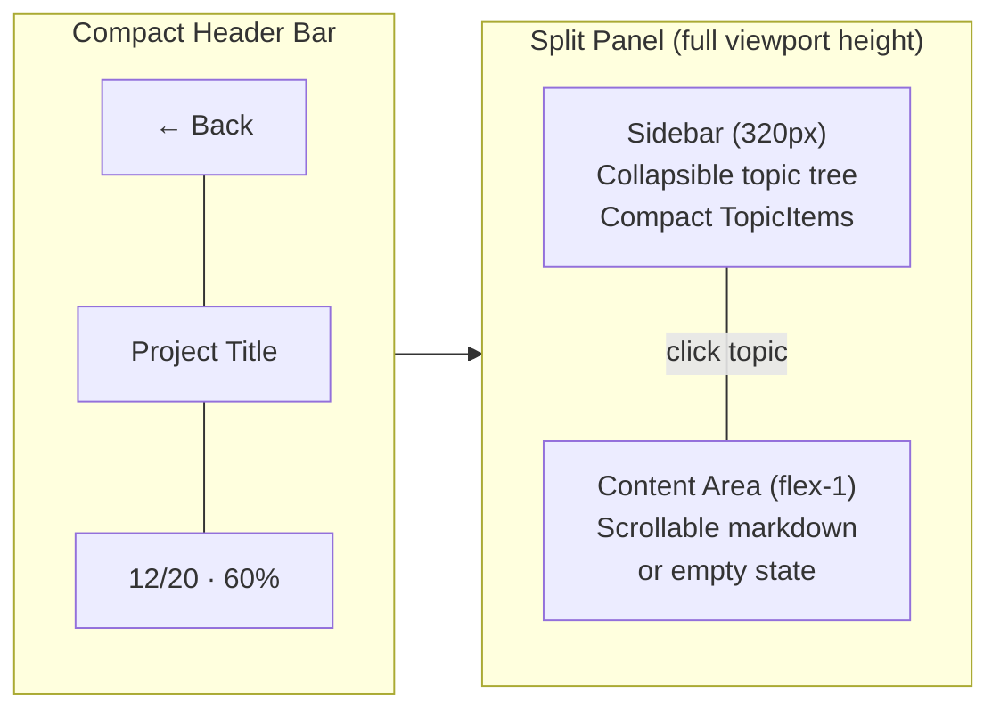

# UI Design System & Layout Decisions

> **Living document.** Every UI/layout change MUST update the current state below. Historical changes are tracked via git history — this file only reflects the **current** design.

---

## Layout Architecture

### App Shell (`Layout.jsx`)
- Top navbar: sticky, backdrop-blur, `max-w-screen-2xl`
- Theme: Dark slate (`bg-slate-950`) with indigo accents

### Dashboard (`Dashboard.jsx`)
- Grid of `ProjectCard` components with progress bars
- Overall completion header with streak counter

### Project Detail (`ProjectDetail.jsx`) — Split Panel


- Sidebar collapses to 48px icon strip
- Both panels scroll independently, full viewport height
- Sub-topics collapsed by default (root expanded)

## Color System

| Token | Usage |
|-------|-------|
| `slate-950` | Page background |
| `slate-900/60` | Card/panel backgrounds |
| `slate-800` | Borders |
| `indigo-400/500` | Primary accent, active state |
| `emerald-400` | Completed |
| `amber-400` | In-progress |
| `slate-500/600` | Not-started |
| `rose-400` | Destructive (logout) |

## Component Modes

| Component | Props | Behavior |
|-----------|-------|----------|
| `TopicItem` | `compact={true}` | Sidebar: small text, truncated, no dropdown |
| `TopicItem` | `compact={false}` | Full-width with dropdown selector |
| `TopicContent` | `fullHeight={true}` | Fills parent, sticky header, scrollable |
| `TopicContent` | `fullHeight={false}` | Standalone card with margin |
| `MermaidBlock` | `chart={string}` | Renders mermaid diagram as SVG with dark theme |

## Mermaid Rendering

- **Package**: `mermaid` (client-side)
- **Component**: `MermaidBlock.jsx` — renders ````mermaid` code blocks as SVG
- **Integration**: Custom `components` prop on `ReactMarkdown` intercepts `language-mermaid` code blocks
- **Theme**: Dark mode matching app palette (indigo primary, slate backgrounds)
- **Fallback**: On parse error, displays raw code in a bordered `<pre>` block
