# Project 1: Build an LLM Playground — Learning Material

## Table of Contents

1. [LLM Overview and Foundations](#1-llm-overview-and-foundations)
2. [Pre-Training](#2-pre-training)
3. [Post-Training](#3-post-training)
4. [Evaluation](#4-evaluation)
5. [Chatbots' Overall Design](#5-chatbots-overall-design)
6. [Glossary](#6-glossary)

---

## 1. LLM Overview and Foundations

### What is an LLM?

A **Large Language Model (LLM)** is a computer program that has learned to understand and generate human language by reading enormous amounts of text. Think of it like a student who has read millions of books and can now write essays, answer questions, and hold conversations.

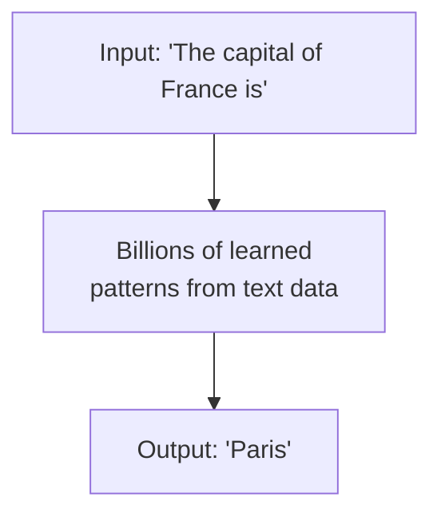

### How Does an LLM Work (Simplified)?

At its core, an LLM predicts the **next word** (or token) given a sequence of previous words. It does this by calculating probabilities:

```
Input: "I like to eat"

Model predicts probabilities:
  "pizza"   → 15%
  "food"    → 12%
  "apples"  → 8%
  "lunch"   → 7%
  ...       → ...
```

The model picks the most likely word (or samples from the distribution) and appends it. Then it repeats the process to generate longer text.

### Key Terminology

| Term       | Meaning                                                  |
|------------|----------------------------------------------------------|
| Token      | A piece of text (word, subword, or character)            |
| Parameter  | A number the model has learned during training           |
| Prompt     | The input text you give to the model                     |
| Inference  | The process of generating output from a trained model    |
| Context    | The text the model can "see" at once (context window)    |

### The Two Phases of Building an LLM

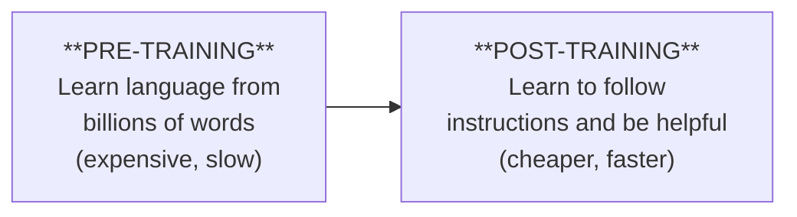

---

## 2. Pre-Training

Pre-training is where the model learns the fundamentals of language. It reads vast amounts of text and learns grammar, facts, reasoning patterns, and more.

### 2.1 Data Collection

#### Where Does Training Data Come From?

LLMs need **terabytes** of text data. Here are the main sources:

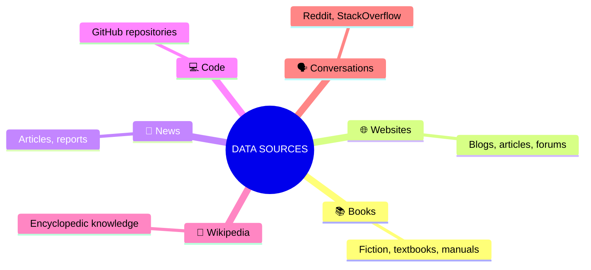

#### Manual Crawling

Some teams build their own web crawlers — programs that visit websites and download their text content:

```python
# Simplified concept of a web crawler (NOT production code)
import requests

def crawl(url):
    response = requests.get(url)
    text = extract_text(response.html)
    save_to_database(text)
```

#### Common Crawl

**Common Crawl** is a free, open dataset of web pages. It contains petabytes of data collected over many years. Most LLM training datasets start with Common Crawl and then filter it.

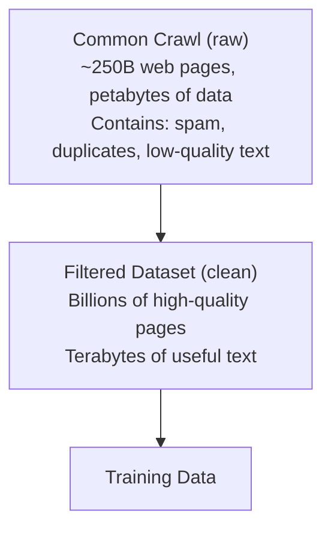

### 2.2 Data Cleaning

Raw web data is messy. It contains spam, ads, duplicates, and nonsense. Cleaning is critical.

#### The Cleaning Pipeline

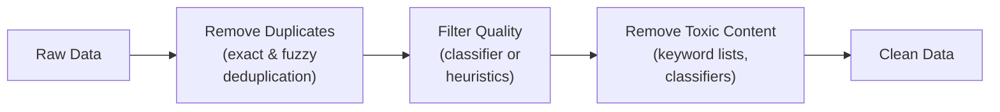

#### Notable Cleaning Projects

| Dataset     | Description                                           |
|-------------|-------------------------------------------------------|
| RefinedWeb  | High-quality web data using strict deduplication      |
| Dolma       | Open dataset by AI2, transparent cleaning pipeline    |
| FineWeb     | By Hugging Face, focuses on educational content       |

#### Example: Simple Quality Filter

```python
def is_quality_text(text):
    """Basic heuristic to check text quality."""
    # Too short? Probably not useful
    if len(text) < 100:
        return False
    # Too many special characters? Might be code/spam
    alpha_ratio = sum(c.isalpha() for c in text) / len(text)
    if alpha_ratio < 0.6:
        return False
    # All caps? Probably spam
    if text == text.upper():
        return False
    return True
```

### 2.3 Tokenization

Computers don't understand words directly — they work with numbers. **Tokenization** converts text into numbers the model can process.

#### Why Not Just Use Characters?

```
"hello" → ['h', 'e', 'l', 'l', 'o']  → 5 tokens

Problem: Sequences become very long!
"The quick brown fox" → 19 character tokens
```

#### Why Not Just Use Words?

```
"hello" → ['hello']  → 1 token

Problem: How do you handle "unhappiness"? Or "ChatGPT"?
You'd need millions of words in your vocabulary!
```

#### Byte Pair Encoding (BPE) — The Sweet Spot

BPE finds a middle ground. It starts with characters and merges the most frequent pairs:

```
Step 1: Start with characters
  "lower" → ['l', 'o', 'w', 'e', 'r']

Step 2: Find most frequent pair, merge it
  'e' + 'r' appears often → merge into 'er'
  "lower" → ['l', 'o', 'w', 'er']

Step 3: Repeat
  'l' + 'o' appears often → merge into 'lo'
  "lower" → ['lo', 'w', 'er']

Continue until vocabulary reaches desired size (e.g., 50,000 tokens)
```

#### How Tokenization Looks in Practice

```python
from transformers import AutoTokenizer

tokenizer = AutoTokenizer.from_pretrained("gpt2")

text = "Hello, world!"
tokens = tokenizer.tokenize(text)
print(tokens)
# ['Hello', ',', 'Ġworld', '!']
#  Note: 'Ġ' represents a leading space

token_ids = tokenizer.encode(text)
print(token_ids)
# [15496, 11, 995, 0]
```

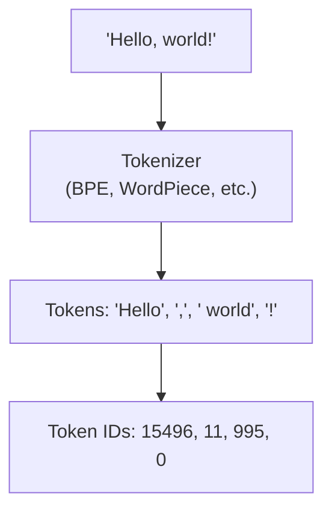

### 2.4 Architecture

#### Neural Networks — The Building Blocks

A **neural network** is inspired by the human brain. It's layers of connected "neurons" that process information:

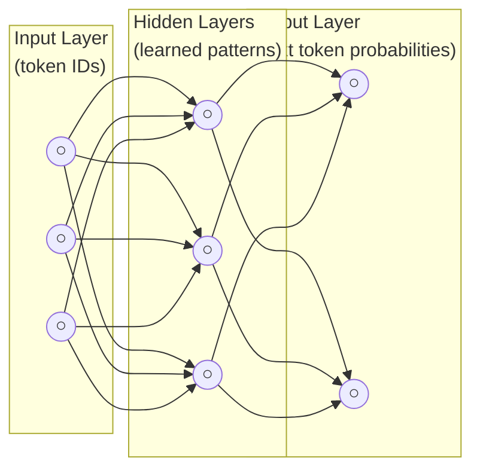

Each connection has a **weight** (a number). Training adjusts these weights so the network produces better outputs.

#### Transformers — The Key Innovation

The **Transformer** architecture (2017) revolutionized language AI. Its key innovation is the **attention mechanism** — the ability to look at all words in a sentence simultaneously and decide which ones are important for each other.

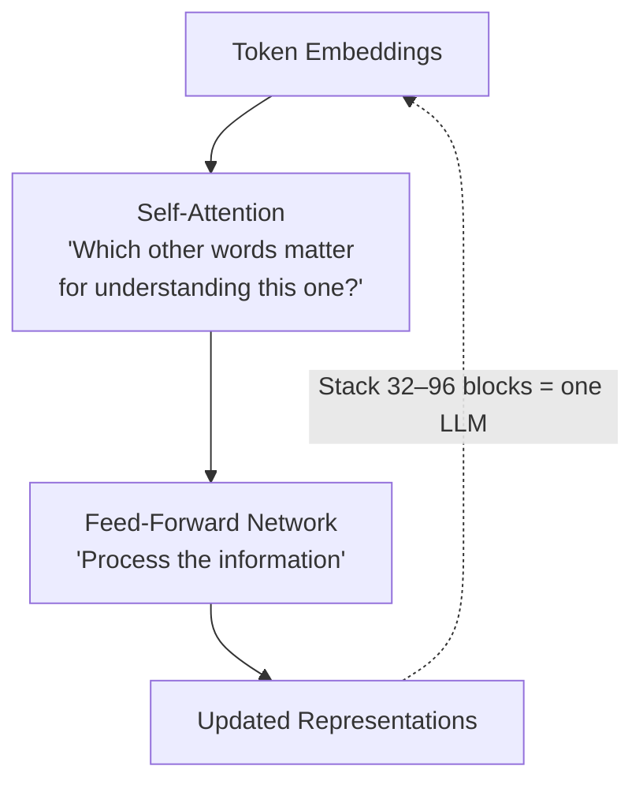

#### Attention — An Intuition

Consider: "The cat sat on the mat because **it** was tired."

What does "it" refer to? The attention mechanism helps the model figure this out:

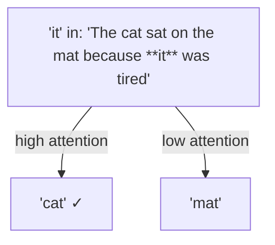

#### The GPT Family

**GPT** (Generative Pre-trained Transformer) by OpenAI uses only the **decoder** part of the Transformer:

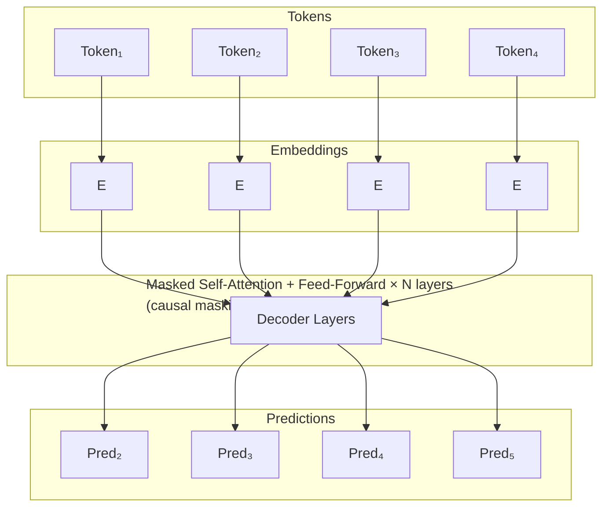

Key point: Each token can only "see" tokens that came before it (not future tokens). This is called **causal masking**.

#### Modern Open-Source Models

| Model     | Creator    | Key Features                                   |
|-----------|------------|------------------------------------------------|
| DeepSeek  | DeepSeek   | Mixture of Experts (MoE), efficient scaling    |
| Qwen      | Alibaba    | Multilingual, strong reasoning                 |
| Gemma     | Google     | Lightweight, good for research                 |
| LLaMA     | Meta       | Open weights, widely adopted                   |

#### Mixture of Experts (MoE) — Used by DeepSeek

Instead of using ALL parameters for every token, MoE activates only a subset:

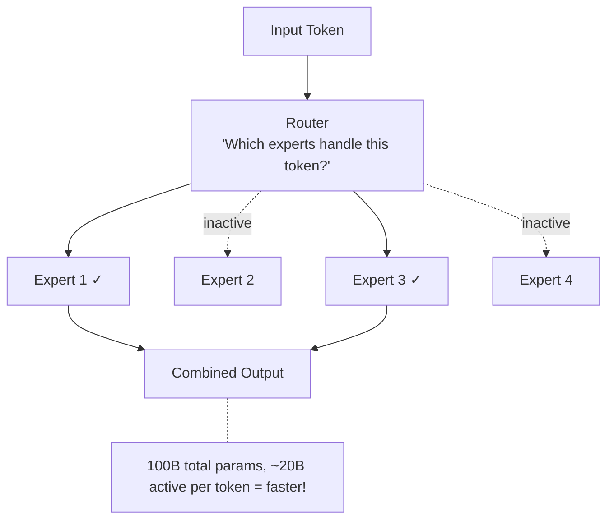

### 2.5 Text Generation

Once a model is trained, how does it actually produce text? There are several strategies:

#### Greedy Search

Pick the highest-probability token at each step:

```
"The best"  →  P(food)=0.3, P(way)=0.25, P(thing)=0.2
                    ↑ pick this (highest)

"The best food"  →  P(is)=0.4, P(in)=0.2, ...
                        ↑ pick this

Result: "The best food is..."
```

**Problem:** Always picks the "safe" choice. Text becomes repetitive and boring.

#### Beam Search

Keep track of multiple possible sequences simultaneously:

```
Beam size = 2 (track top 2 sequences)

Step 1: "The"
  Beam 1: "The best" (score: 0.3)
  Beam 2: "The most" (score: 0.25)

Step 2:
  Beam 1: "The best food" (score: 0.3 × 0.4 = 0.12)
  Beam 2: "The most important" (score: 0.25 × 0.5 = 0.125)  ← winner!

Final: Pick sequence with highest total score
```

**Better than greedy**, but still tends toward generic text.

#### Top-k Sampling

Instead of always picking the best, randomly sample from the top k tokens:

```
Top-k = 3

Probabilities: food(0.3), way(0.25), thing(0.2), car(0.05), ...
                 ↑           ↑           ↑
              Keep these 3, ignore the rest

Renormalize: food(0.4), way(0.33), thing(0.27)
Then randomly sample from these 3.
```

**Result:** More varied, creative text!

#### Top-p (Nucleus) Sampling

Instead of a fixed k, keep tokens until their cumulative probability reaches p:

```
Top-p = 0.9

Sorted probabilities:
  food:  0.30  (cumulative: 0.30)  ✓
  way:   0.25  (cumulative: 0.55)  ✓
  thing: 0.20  (cumulative: 0.75)  ✓
  place: 0.10  (cumulative: 0.85)  ✓
  time:  0.08  (cumulative: 0.93)  ✗ exceeds 0.9!

Keep first 4 tokens, sample from them.
```

**Advantage:** Adapts automatically — when the model is confident, fewer tokens are considered.

#### Temperature

Temperature controls how "sharp" or "flat" the probability distribution is:

```
Original probs:  food(0.5), way(0.3), thing(0.2)

Temperature = 0.5 (more focused):
  food(0.7), way(0.2), thing(0.1)  → almost always picks "food"

Temperature = 1.0 (unchanged):
  food(0.5), way(0.3), thing(0.2)  → balanced

Temperature = 2.0 (more random):
  food(0.35), way(0.33), thing(0.32)  → nearly uniform, very creative
```

```
Low temperature ◄──────────────────► High temperature
(focused, safe)                      (creative, risky)
```

---

## 3. Post-Training

After pre-training, the model knows language but doesn't know how to be **helpful**. Post-training teaches it to follow instructions and be safe.

### 3.1 Supervised Fine-Tuning (SFT)

SFT trains the model on high-quality examples of instructions and good responses:

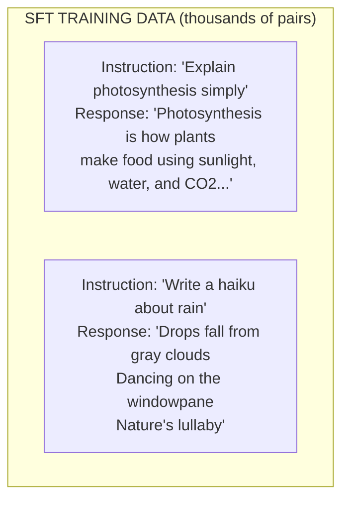

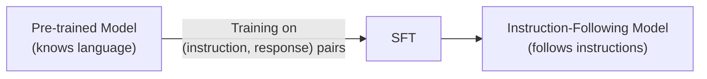

### 3.2 Reinforcement Learning (RL) and RLHF

#### The Problem SFT Can't Fully Solve

SFT only teaches from examples. But what makes a response "good" is subjective and complex. RL lets the model explore and learn from feedback.

#### RLHF (RL from Human Feedback)

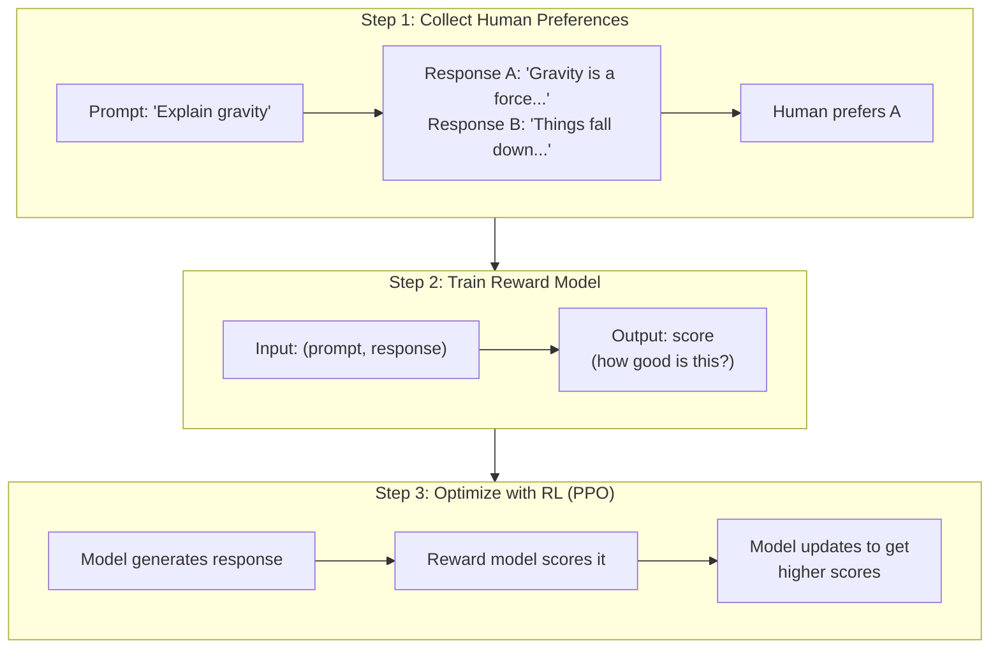

#### Verifiable Tasks

Some tasks have objectively correct answers (math, code). For these, we don't need human judges — we can verify automatically:

```python
# Verifiable reward for math:
def reward(model_answer, correct_answer):
    if model_answer == correct_answer:
        return 1.0  # Correct!
    else:
        return 0.0  # Wrong.

# Example:
# Prompt: "What is 2 + 2?"
# Model says: "4"  → reward = 1.0
# Model says: "5"  → reward = 0.0
```

#### Reward Models

For subjective tasks (writing, explanations), we train a **reward model** — a separate neural network that predicts human preferences:

```
Reward Model Training:

  Input: (prompt, response_A, response_B, human_preference)
  Learn: score(prompt, response_A) > score(prompt, response_B)

After Training:
  reward_model("Explain gravity", "Gravity is a fundamental force...") → 0.85
  reward_model("Explain gravity", "idk stuff falls")                   → 0.12
```

#### PPO (Proximal Policy Optimization)

PPO is the RL algorithm that updates the LLM based on reward signals. The key idea: don't change too much at once.

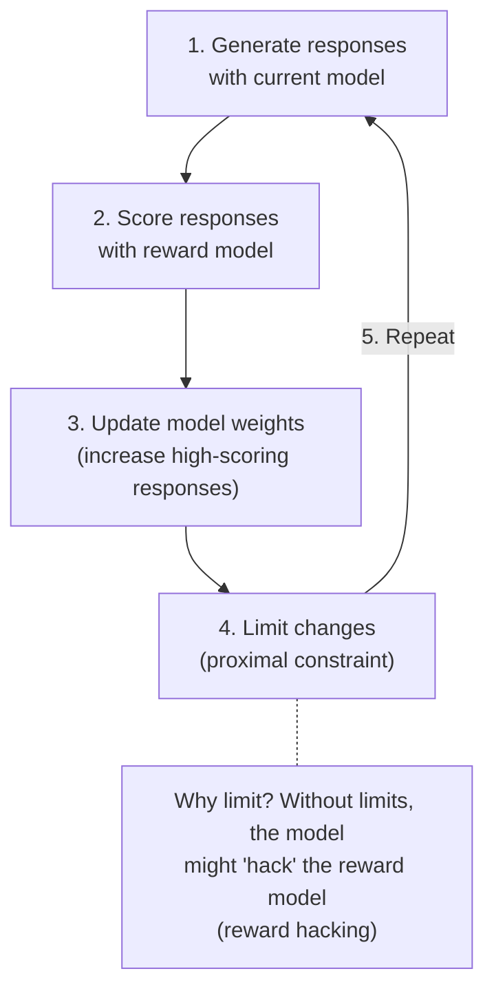

#### Other RL Approaches

| Method | Description                                              |
|--------|----------------------------------------------------------|
| DPO    | Direct Preference Optimization — skip the reward model   |
| GRPO   | Group Relative Policy Optimization — used by DeepSeek    |
| KTO    | Kahneman-Tversky Optimization — uses binary feedback     |

---

## 4. Evaluation

How do we know if an LLM is good? Evaluation is surprisingly difficult.

### 4.1 Traditional Metrics

These are automated metrics computed from model outputs:

| Metric      | What It Measures                        | Limitation                  |
|-------------|------------------------------------------|------------------------------|
| Perplexity  | How surprised the model is by text       | Lower = better, but narrow   |
| BLEU        | Overlap with reference translations      | Misses meaning, just words   |
| ROUGE       | Overlap with reference summaries         | Same issues as BLEU          |

```
Perplexity Intuition:

  "The cat sat on the ___"
  Model predicts: mat(0.4), floor(0.3), chair(0.2)

  If actual word = "mat":  Low perplexity (model expected this)
  If actual word = "xylophone":  High perplexity (model surprised!)

  Lower perplexity = model is better at predicting language
```

### 4.2 Task-Specific Benchmarks

Modern LLMs are tested on specific tasks:

| Benchmark   | Tests                                         |
|-------------|-----------------------------------------------|
| MMLU        | Multiple-choice questions across 57 subjects  |
| HumanEval   | Code generation (write Python functions)      |
| GSM8K       | Grade-school math word problems               |
| TruthfulQA  | Whether model avoids common misconceptions    |
| ARC         | Science questions (grade school level)        |
| HellaSwag   | Common sense reasoning                        |

```
Example from MMLU:

Question: What is the capital of Australia?
A) Sydney
B) Melbourne
C) Canberra  ← correct
D) Brisbane

Model picks C → score +1
```

### 4.3 Human Evaluation and Leaderboards

#### Human Evaluation

Humans rate model outputs on criteria like:
- **Helpfulness** — Does it answer the question?
- **Harmlessness** — Is it safe?
- **Honesty** — Does it acknowledge uncertainty?

#### Chatbot Arena (LMSYS)

A popular leaderboard where humans compare two anonymous models side by side:

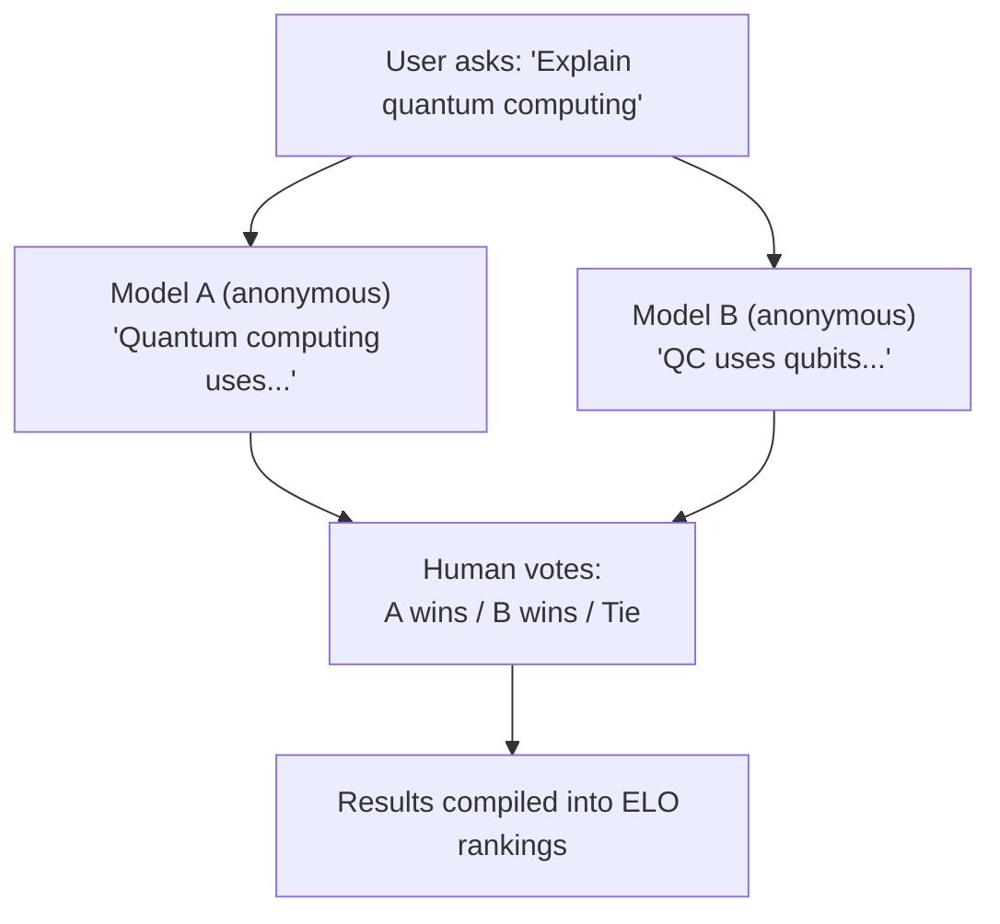

---

## 5. Chatbots' Overall Design

A chatbot powered by an LLM is more than just the model. Here's the full architecture:

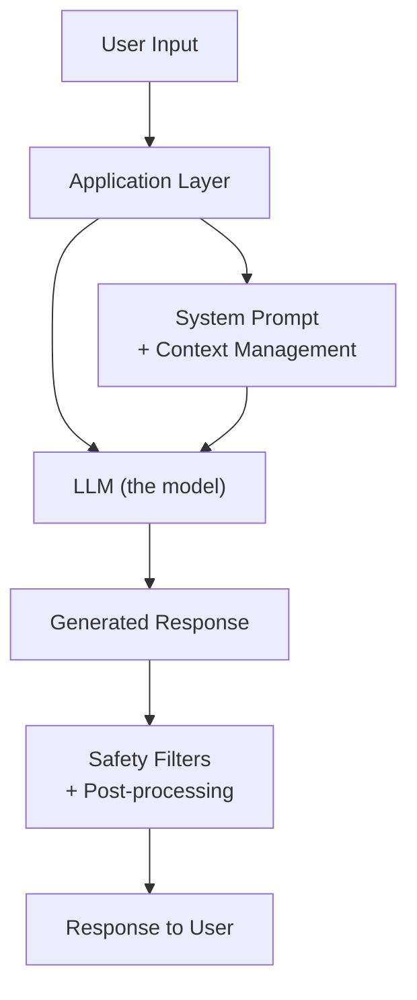

### Key Components

#### 1. System Prompt

A hidden instruction that tells the model how to behave:

```
System: "You are a helpful coding assistant.
         Always provide code examples.
         If you're unsure, say so."
```

#### 2. Conversation History (Context Management)

The model sees the full conversation to maintain context:

```
Messages = [
    {"role": "system", "content": "You are helpful..."},
    {"role": "user", "content": "What is Python?"},
    {"role": "assistant", "content": "Python is a programming..."},
    {"role": "user", "content": "Show me an example"},  ← current
]
```

Since models have limited context windows, old messages may need to be summarized or dropped.

#### 3. Safety Filters

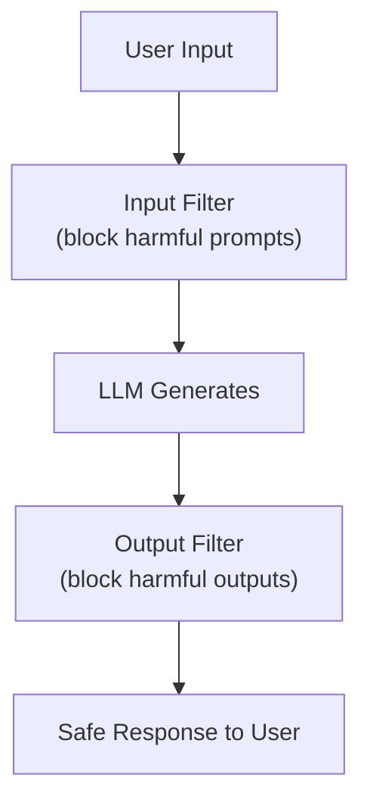

#### 4. Retrieval-Augmented Generation (RAG)

Instead of relying only on training data, the model can search external documents:

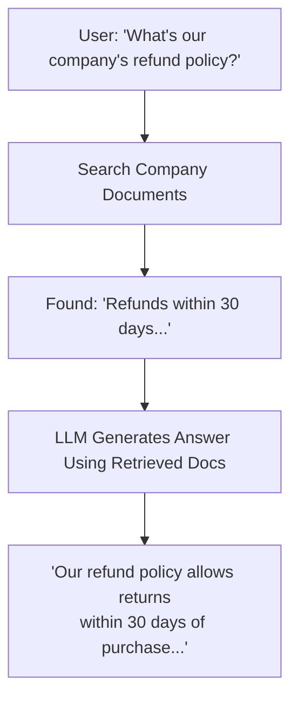

---

## 6. Glossary

| Term | Definition |
|------|-----------|
| **Attention** | Mechanism that lets the model weigh the importance of different tokens relative to each other |
| **Beam Search** | Text generation strategy that tracks multiple candidate sequences simultaneously |
| **BPE** | Byte Pair Encoding — a tokenization method that merges frequent character pairs |
| **Causal Masking** | Restriction that prevents tokens from attending to future tokens |
| **Common Crawl** | A free, open repository of web crawl data |
| **Context Window** | The maximum number of tokens the model can process at once |
| **Decoder** | The part of a Transformer that generates output tokens one at a time |
| **DPO** | Direct Preference Optimization — an alternative to PPO for alignment |
| **Embedding** | A vector (list of numbers) representing a token or concept |
| **Fine-tuning** | Continuing to train a model on a smaller, specialized dataset |
| **GPT** | Generative Pre-trained Transformer — a decoder-only model architecture |
| **Greedy Search** | Text generation that always picks the highest-probability token |
| **GRPO** | Group Relative Policy Optimization — RL method used by DeepSeek |
| **Inference** | Running a trained model to produce outputs |
| **LLM** | Large Language Model — a neural network trained on vast text data |
| **MoE** | Mixture of Experts — architecture that activates only some parameters per input |
| **Parameter** | A trainable number in the neural network (weights and biases) |
| **Perplexity** | Metric measuring how well a model predicts text (lower is better) |
| **PPO** | Proximal Policy Optimization — an RL algorithm for model fine-tuning |
| **Pre-training** | The initial phase of training on large unlabeled text data |
| **Prompt** | The input text provided to the model |
| **RAG** | Retrieval-Augmented Generation — combining search with generation |
| **Reward Model** | A model that scores how "good" a response is |
| **RLHF** | Reinforcement Learning from Human Feedback |
| **SFT** | Supervised Fine-Tuning — training on labeled instruction-response pairs |
| **Temperature** | Parameter controlling randomness in text generation |
| **Token** | The basic unit of text the model processes (word, subword, or character) |
| **Top-k** | Sampling strategy that considers only the k most likely tokens |
| **Top-p** | Sampling strategy that considers tokens until cumulative probability reaches p |
| **Transformer** | Neural network architecture based on self-attention |

---

## Further Reading

- [Attention Is All You Need](https://arxiv.org/abs/1706.03762) — The original Transformer paper
- [Hugging Face Course](https://huggingface.co/learn) — Free NLP course
- [Andrej Karpathy's YouTube](https://www.youtube.com/@AndrejKarpathy) — Great video explanations
- [The Illustrated Transformer](https://jalammar.github.io/illustrated-transformer/) — Visual guide
