# Project 2: Build a Customer Support Chatbot Using RAGs and Prompt Engineering

## Learning Material — A Beginner's Guide

---

## Table of Contents

1. [Overview of Adaptation Techniques](#1-overview-of-adaptation-techniques)
2. [Finetuning](#2-finetuning)
3. [Prompt Engineering](#3-prompt-engineering)
4. [RAGs Overview](#4-rags-overview)
5. [Retrieval](#5-retrieval)
6. [Generation](#6-generation)
7. [RAFT: Training Technique for RAGs](#7-raft-training-technique-for-rags)
8. [Evaluation](#8-evaluation)
9. [RAGs' Overall Design](#9-rags-overall-design)
10. [Glossary](#10-glossary)

---

## 1. Overview of Adaptation Techniques

When you have a pre-trained Large Language Model (LLM), it knows a lot about general language but nothing about *your* specific data — your company's FAQ, your product manuals, or your customer policies. You need to **adapt** it.

There are three main approaches:

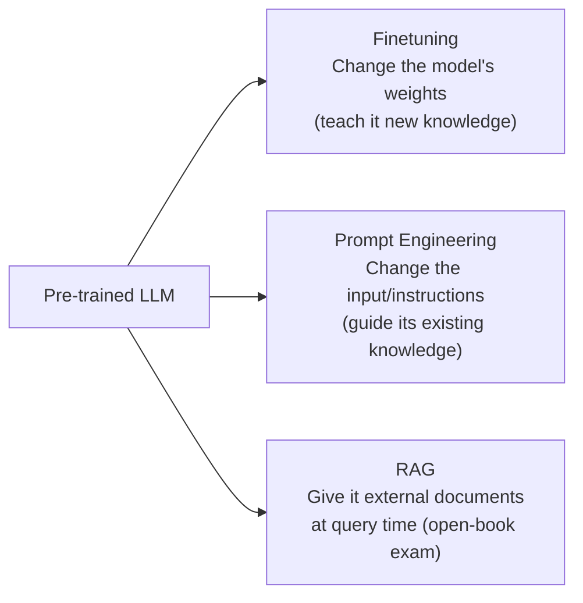

### When to Use What?

| Technique | Best For | Cost | Complexity |
|-----------|----------|------|------------|
| Finetuning | Teaching new behaviors/styles | High | High |
| Prompt Engineering | Guiding existing capabilities | Low | Low |
| RAG | Using up-to-date or proprietary data | Medium | Medium |

**Analogy:**
- **Finetuning** = Sending the model to school to learn new subjects
- **Prompt Engineering** = Giving the model clear exam instructions
- **RAG** = Letting the model use a textbook during the exam

---

## 2. Finetuning

Finetuning means taking a pre-trained model and training it further on your specific data so it "learns" your domain.

### The Problem with Full Finetuning

A model like GPT has billions of parameters (numbers that define its behavior). Updating ALL of them requires:
- Enormous GPU memory
- Huge datasets
- Days of training time

### Parameter-Efficient Fine-Tuning (PEFT)

PEFT solves this by updating only a **small subset** of parameters while keeping most of the model frozen.

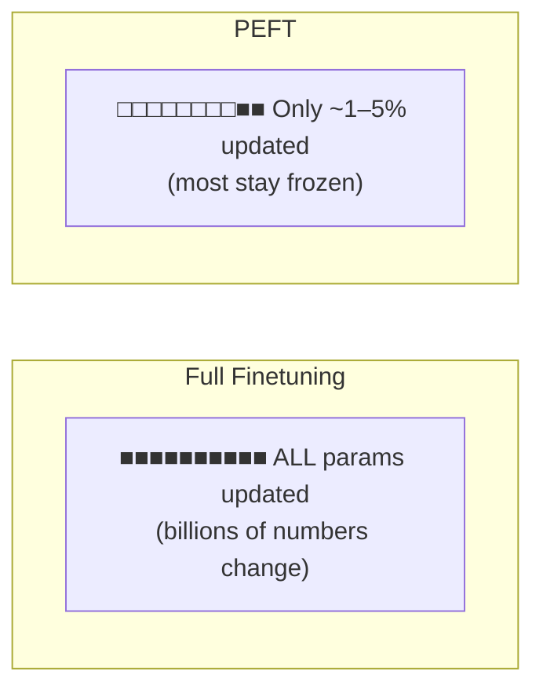

### Adapters

Adapters are small neural network layers inserted *between* the existing layers of a model. Only the adapter layers are trained.

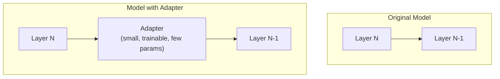

### LoRA (Low-Rank Adaptation)

LoRA is the most popular PEFT method. Instead of updating a large weight matrix directly, it decomposes the update into two small matrices.

```
Original Weight Matrix W (e.g., 1000 x 1000 = 1,000,000 params)

With LoRA:
    W_original (frozen) + ΔW (learned)

    ΔW = A × B
    where A is 1000 × 4 and B is 4 × 1000

    Total new params: 1000×4 + 4×1000 = 8,000
    vs original:       1,000,000

    That's 99.2% fewer parameters to train!
```

**Simple LoRA Example (conceptual):**

```python
# Conceptual — how LoRA works internally
import torch

# Original large weight matrix (frozen, not trained)
W_original = torch.randn(1000, 1000)

# LoRA adds two small matrices (these ARE trained)
rank = 4  # The "low rank" — smaller = fewer params
A = torch.randn(1000, rank)  # 1000 × 4
B = torch.randn(rank, 1000)  # 4 × 1000

# The effective weight becomes:
W_effective = W_original + A @ B
```

---

## 3. Prompt Engineering

Prompt Engineering is the art of writing good instructions for an LLM. No model retraining needed — you just change what you *say* to the model.

### Zero-Shot Prompting

You ask the model to do something with NO examples:

```python
prompt = """You are a customer support agent for TechCo.
Answer the following customer question helpfully and concisely.

Customer Question: How do I reset my password?

Answer:"""
```

The model uses only its pre-trained knowledge — no examples provided.

### Few-Shot Prompting

You provide a few examples so the model understands the pattern:

```python
prompt = """You are a customer support agent. Answer questions using
the style shown in these examples:

Example 1:
Customer: What are your hours?
Agent: We're available Monday–Friday, 9 AM to 6 PM EST. 
       Weekend support is available via email.

Example 2:
Customer: How do I track my order?
Agent: You can track your order at trackmy.techco.com using 
       the order number from your confirmation email.

Now answer this:
Customer: How do I return a product?
Agent:"""
```

### Chain-of-Thought (CoT) Prompting

You ask the model to think step-by-step before answering:

```python
prompt = """A customer says: "I was charged $50 but my plan is $30/month 
and I have a 20% discount."

Let's solve this step by step:
1. Base plan cost: $30/month
2. Discount: 20% of $30 = $6
3. Expected charge: $30 - $6 = $24
4. Actual charge: $50
5. Overcharge: $50 - $24 = $26

The customer was overcharged by $26. We should issue a refund.

---

Now solve this:
A customer says: "I was charged $80 but my plan is $60/month 
and I have a 10% loyalty discount."

Let's solve this step by step:"""
```

### Role-Specific and User-Context Prompting

Give the model a role AND context about the user:

```python
prompt = """ROLE: You are Sarah, a senior support agent at TechCo 
specializing in billing issues. You are patient, empathetic, and 
always offer concrete solutions.

USER CONTEXT:
- Name: John
- Account type: Premium
- Customer since: 2020
- Previous issues: 2 billing disputes (both resolved)

INSTRUCTIONS:
- Address John by name
- Acknowledge his loyalty as a Premium member
- Be extra careful with billing topics given his history

John's message: "I was charged twice this month."

Sarah's response:"""
```

### Comparison Diagram

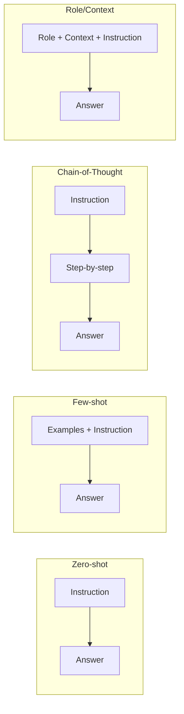

---

## 4. RAGs Overview

**RAG = Retrieval-Augmented Generation**

RAG is a technique where, instead of relying solely on what the model memorized during training, you **retrieve relevant documents** and include them in the prompt so the model can generate answers based on actual data.

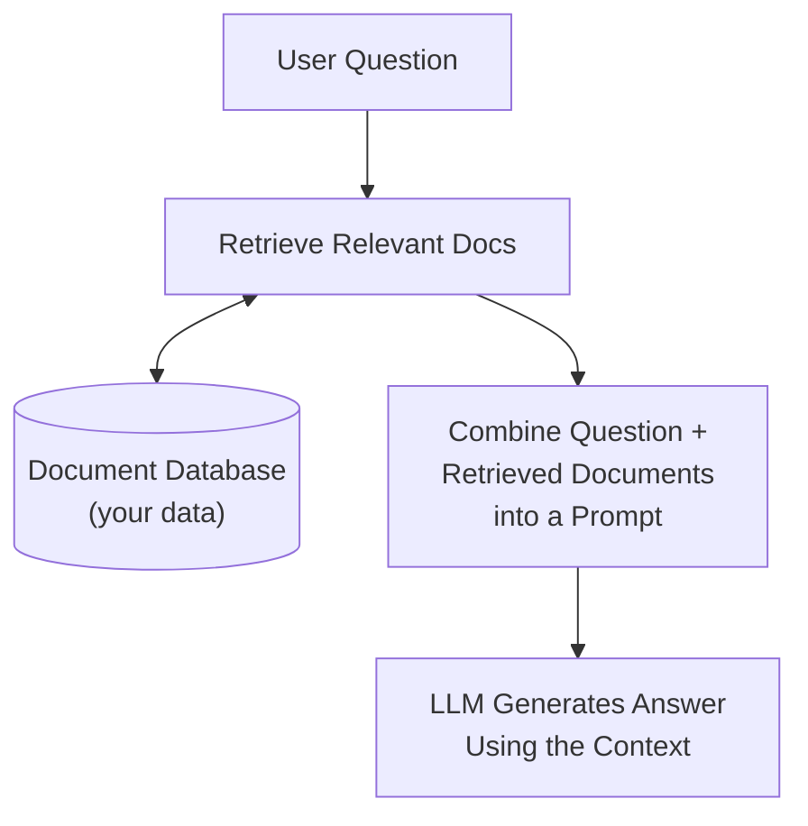

### Why RAG?

| Problem | How RAG Solves It |
|---------|-------------------|
| Model doesn't know your private data | Retrieves your documents at query time |
| Model's knowledge is outdated | Uses current documents |
| Model "halluccinates" (makes stuff up) | Grounds answers in real sources |
| Finetuning is expensive | No retraining needed |

### RAG vs Finetuning

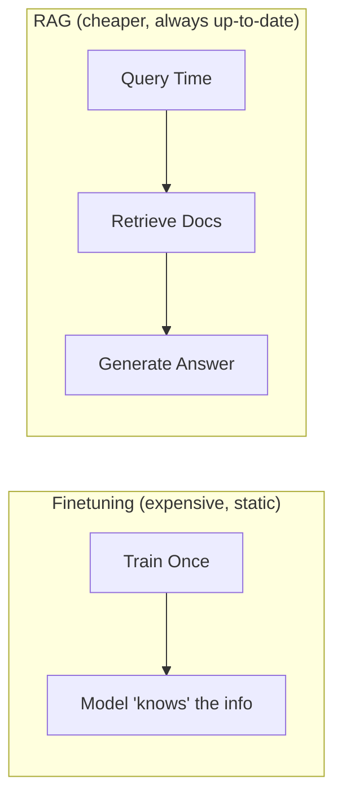

---

## 5. Retrieval

The Retrieval step is about finding the most relevant pieces of information from your document collection. It has two main parts: **preparing documents** and **searching them**.

### 5.1 Document Parsing

Before you can search documents, you need to extract text from them.

#### Rule-Based Parsing

Uses predefined rules to extract text based on document structure:

```python
# Rule-based: Extract text from a structured FAQ
def parse_faq(text):
    """Split FAQ into question-answer pairs using pattern matching."""
    pairs = []
    lines = text.split('\n')
    current_q = None
    current_a = []
    
    for line in lines:
        if line.startswith('Q:'):
            if current_q:
                pairs.append({'question': current_q, 'answer': ' '.join(current_a)})
            current_q = line[2:].strip()
            current_a = []
        elif line.startswith('A:'):
            current_a.append(line[2:].strip())
        elif current_a:
            current_a.append(line.strip())
    
    if current_q:
        pairs.append({'question': current_q, 'answer': ' '.join(current_a)})
    return pairs
```

**Pros:** Fast, predictable, no AI needed  
**Cons:** Breaks on unstructured or messy documents

#### AI-Based Parsing

Uses machine learning to understand document structure:

```python
# AI-based parsing with a library like unstructured
from langchain_community.document_loaders import PyPDFLoader

loader = PyPDFLoader("support_manual.pdf")
documents = loader.load()

# Each document has: page_content (text) and metadata (page number, etc.)
for doc in documents:
    print(f"Page {doc.metadata['page']}: {doc.page_content[:100]}...")
```

**Pros:** Handles any format (PDF, Word, HTML, images)  
**Cons:** Slower, may need ML models

### 5.2 Chunking Strategies

Documents are often too long to fit in a prompt. We split them into smaller **chunks**.

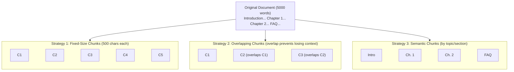

```python
from langchain.text_splitter import RecursiveCharacterTextSplitter

# Create a text splitter with overlap
splitter = RecursiveCharacterTextSplitter(
    chunk_size=500,       # Each chunk is ~500 characters
    chunk_overlap=50,     # 50 characters overlap between chunks
    separators=["\n\n", "\n", ". ", " "]  # Split at natural boundaries
)

text = "Your long document text here..."
chunks = splitter.split_text(text)

# Result: list of strings, each ~500 chars with 50 char overlap
```

### 5.3 Indexing

Once you have chunks, you need to organize them for fast searching. This is called **indexing**.

#### Types of Indexing

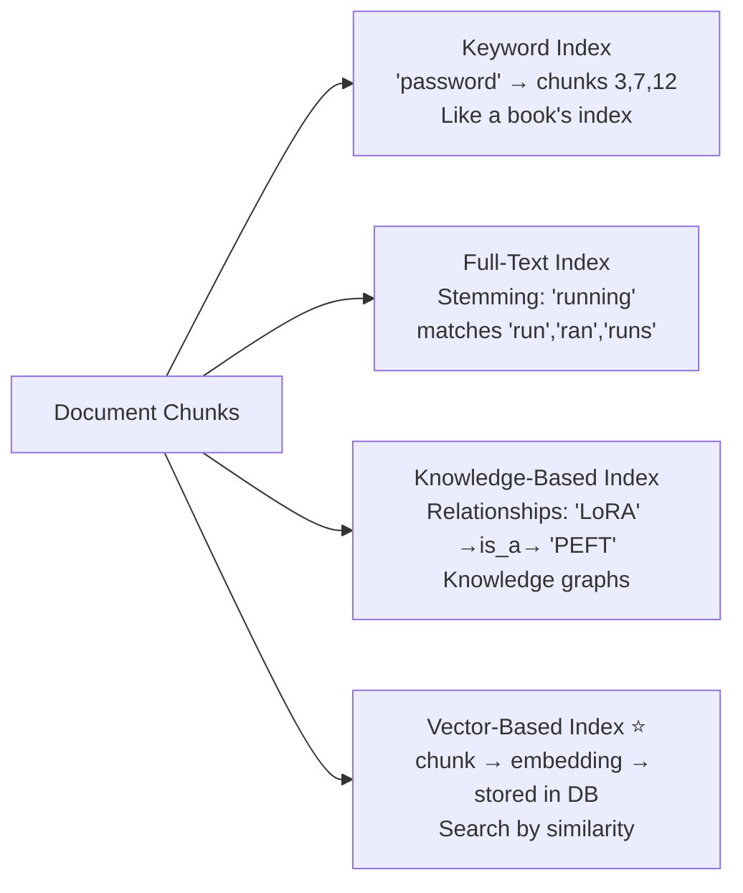

#### Embedding Models

An **embedding model** converts text into a list of numbers (a vector) that captures its *meaning*.

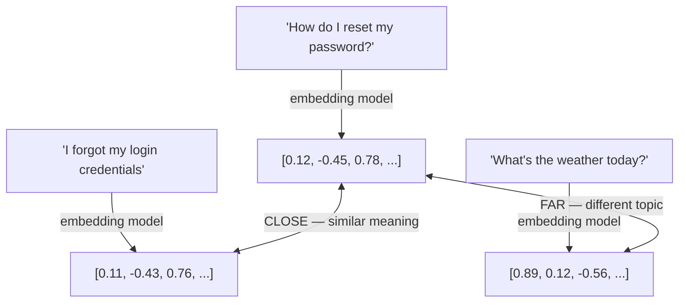

```python
from sentence_transformers import SentenceTransformer

# Load a pre-trained embedding model
model = SentenceTransformer('all-MiniLM-L6-v2')

# Convert text to embeddings
sentences = [
    "How do I reset my password?",
    "I forgot my login credentials",
    "What's the weather today?"
]

embeddings = model.encode(sentences)
# embeddings[0] and embeddings[1] will be similar (close vectors)
# embeddings[2] will be different (far vector)
```

---

## 6. Generation

Once you've retrieved relevant documents, you need to **search** efficiently and then **generate** an answer.

### 6.1 Search Methods

#### Exact Nearest Neighbor (Brute Force)

Compare the query vector to EVERY document vector. Always finds the true closest match.

```
Query Vector: [0.5, 0.3, 0.8]

Compare to ALL documents:
  Doc 1: [0.4, 0.2, 0.7] → distance = 0.17  ✓ closest!
  Doc 2: [0.9, 0.1, 0.2] → distance = 0.85
  Doc 3: [0.5, 0.4, 0.9] → distance = 0.14  ✓ actually closest!
  Doc 4: [0.1, 0.8, 0.3] → distance = 0.76
  ... (check every single one)
```

**Pros:** 100% accurate  
**Cons:** Extremely slow with millions of documents

#### Approximate Nearest Neighbor (ANN)

Uses clever data structures to find *approximately* the closest matches much faster.

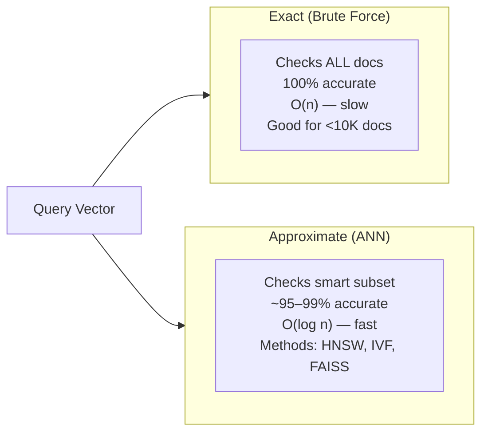

Popular vector databases like **ChromaDB**, **Pinecone**, **FAISS**, and **Weaviate** implement ANN algorithms.

### 6.2 Prompt Engineering for RAGs

Once you retrieve relevant chunks, you build a prompt that includes them:

```python
def build_rag_prompt(user_question, retrieved_chunks):
    """Build a prompt that includes retrieved context."""
    
    context = "\n\n".join(retrieved_chunks)
    
    prompt = f"""You are a helpful customer support assistant for TechCo.
Answer the customer's question using ONLY the information provided in the 
Context below. If the answer is not in the context, say "I don't have 
information about that, let me connect you with a human agent."

Context:
{context}

Customer Question: {user_question}

Instructions:
- Be concise and helpful
- Quote specific details from the context
- If unsure, admit it rather than guessing
- Suggest next steps when appropriate

Answer:"""
    
    return prompt
```

**Key principles for RAG prompts:**

1. **Ground the model** — Tell it to ONLY use the provided context
2. **Handle missing info** — Tell it what to do when the answer isn't in the context
3. **Set the tone** — Specify how to communicate (concise, friendly, technical, etc.)
4. **Prevent hallucination** — Explicitly say "don't make things up"

---

## 7. RAFT: Training Technique for RAGs

**RAFT = Retrieval-Augmented Fine-Tuning**

RAFT is a technique that trains the model to be *better at using retrieved documents*. Instead of just fine-tuning on question-answer pairs, you fine-tune on (question + documents → answer) triples, including both relevant AND irrelevant documents.

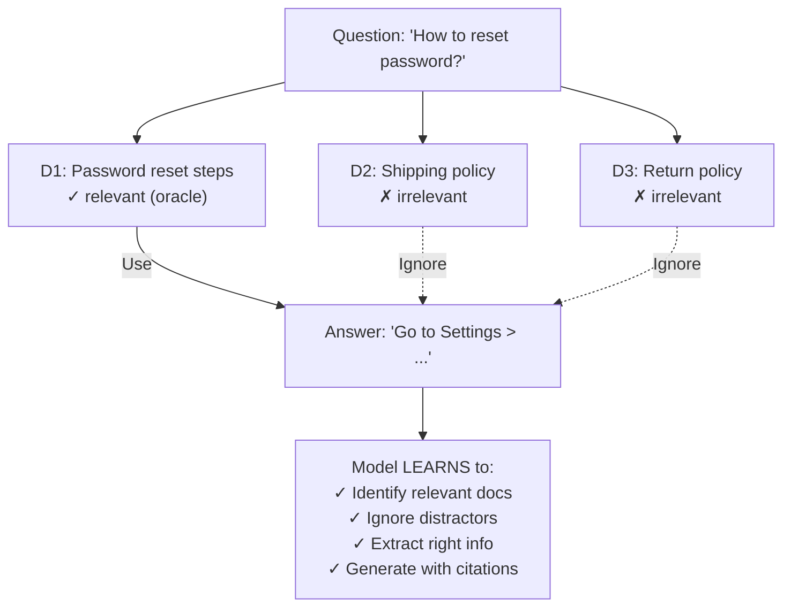

### RAFT Training Data Format

```python
# Example RAFT training data point
training_example = {
    "question": "What is the return policy for electronics?",
    "documents": [
        "D1 (distractor): Our shipping takes 3-5 business days...",
        "D2 (oracle): Electronics can be returned within 30 days with receipt...",
        "D3 (distractor): Customer loyalty program offers 10% discount...",
    ],
    "answer": "Based on document D2: Electronics can be returned within "
              "30 days of purchase. You'll need your original receipt. "
              "Items must be in original packaging."
}
```

### Why RAFT Helps

| Without RAFT | With RAFT |
|---|---|
| Model may get confused by irrelevant docs | Model learns to ignore distractors |
| May hallucinate from wrong documents | Cites the correct source |
| Generic use of context | Precise extraction of relevant info |

---

## 8. Evaluation

How do you know if your RAG system is working well? There are three main metrics:

### 8.1 Context Relevance

**Question:** Are the retrieved documents actually relevant to the user's question?

```
User asks: "How do I cancel my subscription?"

Retrieved chunks:
  ✓ Chunk 1: "To cancel your subscription, go to Settings..."  → RELEVANT
  ✗ Chunk 2: "Our company was founded in 2010..."              → NOT RELEVANT
  ✓ Chunk 3: "Cancellation takes effect at billing cycle end..." → RELEVANT

Context Relevance Score = relevant chunks / total chunks = 2/3 = 0.67
```

### 8.2 Faithfulness

**Question:** Is the generated answer actually supported by the retrieved context? (No hallucination)

```
Context: "Refunds are processed within 5-7 business days."

Generated Answer: "Your refund will arrive in 5-7 business days."
→ Faithfulness: HIGH ✓ (matches context)

Generated Answer: "Your refund will arrive in 24 hours."
→ Faithfulness: LOW ✗ (contradicts context / not in context)
```

### 8.3 Answer Correctness

**Question:** Is the final answer actually correct and helpful?

```
User Question: "What's your phone support number?"
Ground Truth: "1-800-555-0123"

Generated: "Our phone support is 1-800-555-0123, available 9-5 EST"
→ Correctness: HIGH ✓

Generated: "Please email support@techco.com"
→ Correctness: LOW ✗ (didn't answer the question)
```

### Evaluation Framework Diagram

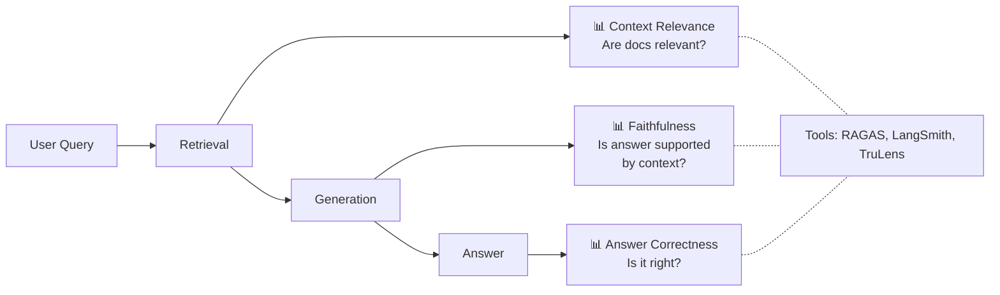

```python
# Simplified evaluation example
def evaluate_rag_response(question, context_chunks, generated_answer, ground_truth):
    """Evaluate a RAG response on three dimensions."""
    
    # 1. Context Relevance (are chunks related to the question?)
    relevant_count = sum(1 for chunk in context_chunks 
                        if is_relevant(chunk, question))
    context_relevance = relevant_count / len(context_chunks)
    
    # 2. Faithfulness (is answer supported by context?)
    answer_claims = extract_claims(generated_answer)
    supported_claims = sum(1 for claim in answer_claims 
                          if is_supported_by(claim, context_chunks))
    faithfulness = supported_claims / len(answer_claims) if answer_claims else 0
    
    # 3. Correctness (does answer match ground truth?)
    correctness = compute_similarity(generated_answer, ground_truth)
    
    return {
        "context_relevance": context_relevance,
        "faithfulness": faithfulness,
        "answer_correctness": correctness
    }
```

---

## 9. RAGs' Overall Design

Here's the complete architecture of a RAG system from start to finish:

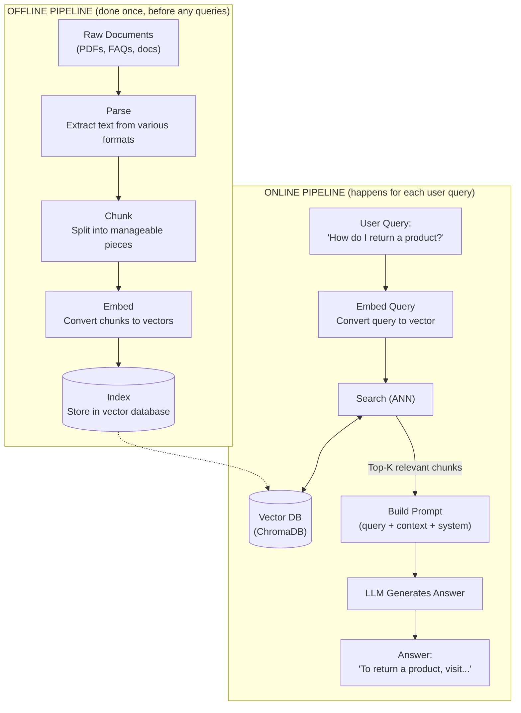

### Design Decisions Summary

| Component | Options | Recommendation for Beginners |
|-----------|---------|------------------------------|
| Document Parser | PyPDF, Unstructured, custom | LangChain loaders |
| Chunking | Fixed, overlap, semantic | Recursive with overlap |
| Embedding Model | OpenAI, Sentence-Transformers | `all-MiniLM-L6-v2` (free) |
| Vector Store | ChromaDB, FAISS, Pinecone | ChromaDB (simple, local) |
| Search | Exact, ANN | ChromaDB default (ANN) |
| LLM | GPT-4, Llama, Mistral | OpenAI GPT or HuggingFace |
| Framework | LangChain, LlamaIndex | LangChain (most tutorials) |

---

## 10. Glossary

| Term | Definition |
|------|-----------|
| **LLM** | Large Language Model — an AI trained on massive text data (e.g., GPT-4, Llama) |
| **RAG** | Retrieval-Augmented Generation — giving an LLM external documents to answer from |
| **Embedding** | A list of numbers representing the meaning of text |
| **Vector** | A list of numbers (same as embedding in this context) |
| **Vector Database** | A database optimized for storing and searching embeddings |
| **Chunk** | A small piece of a larger document |
| **Token** | A piece of text (roughly a word or part of a word) that LLMs process |
| **Prompt** | The text input you give to an LLM |
| **Hallucination** | When an LLM confidently generates incorrect information |
| **Finetuning** | Further training a model on specific data |
| **PEFT** | Parameter-Efficient Fine-Tuning — training only a small part of the model |
| **LoRA** | Low-Rank Adaptation — a popular PEFT method using small matrix decomposition |
| **Adapter** | A small trainable layer inserted into a frozen model |
| **ANN** | Approximate Nearest Neighbor — fast similarity search |
| **RAFT** | Retrieval-Augmented Fine-Tuning — training models to better use retrieved docs |
| **Faithfulness** | Whether an answer is supported by the provided context |
| **Context Window** | The maximum amount of text an LLM can process at once |
| **Cosine Similarity** | A way to measure how similar two vectors are (0 = unrelated, 1 = identical) |
| **ChromaDB** | An open-source vector database, great for local development |
| **LangChain** | A popular Python framework for building LLM applications |
| **Sentence-Transformers** | A library for creating text embeddings |
| **Few-shot** | Providing examples in a prompt to guide the model |
| **Zero-shot** | Asking the model to do something with no examples |
| **Chain-of-Thought** | Prompting the model to reason step-by-step |

---

## Further Reading

- [LangChain Documentation](https://python.langchain.com/)
- [ChromaDB Documentation](https://docs.trychroma.com/)
- [Sentence-Transformers](https://www.sbert.net/)
- [RAGAS Evaluation Framework](https://docs.ragas.io/)
- [LoRA Paper](https://arxiv.org/abs/2106.09685)
- [RAFT Paper](https://arxiv.org/abs/2403.10131)

---

*Next: Head over to [PROJECT.md](./PROJECT.md) to build a working Customer Support Chatbot!*
