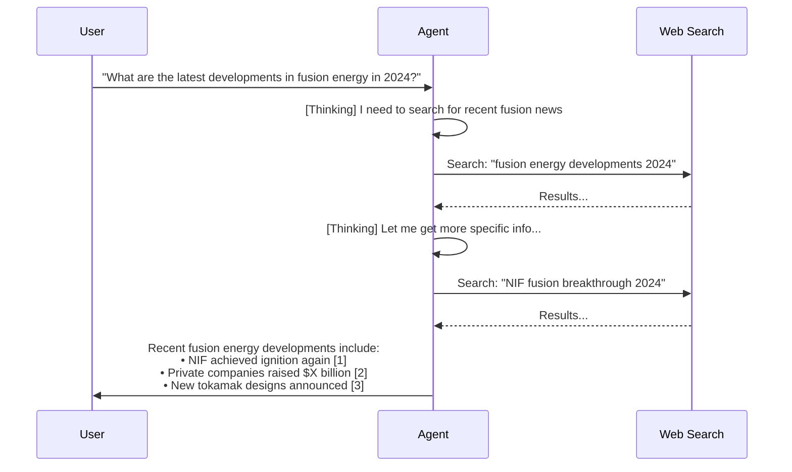

# Project 3: Build an "Ask-the-Web" Agent

## What We're Building

An AI agent that works like Perplexity AI — you ask a question, it searches the web, reads multiple sources, and gives you a synthesized answer with citations.



---

## Prerequisites

### What You Need to Know
- Basic Python (variables, functions, loops, dictionaries)
- How to use a terminal/command prompt
- Basic understanding of APIs (we'll explain as we go)

### Software Required
- Python 3.9 or higher
- A text editor (VS Code recommended)
- An OpenAI API key (or compatible API)
- A Tavily API key (for web search — free tier available)

---

## Step 0: Environment Setup

### 0.1 Create the Project Folder

```bash
mkdir ask-the-web-agent
cd ask-the-web-agent
```

### 0.2 Create a Virtual Environment

```bash
python -m venv venv

# Windows:
venv\Scripts\activate

# Mac/Linux:
source venv/bin/activate
```

### 0.3 Install Dependencies

Create a `requirements.txt` file:

```text
openai>=1.30.0
tavily-python>=0.3.0
python-dotenv>=1.0.0
beautifulsoup4>=4.12.0
requests>=2.31.0
```

Install them:

```bash
pip install -r requirements.txt
```

### 0.4 Get Your API Keys

1. **OpenAI API Key:** Go to https://platform.openai.com/api-keys and create a key
2. **Tavily API Key:** Go to https://tavily.com and sign up (free tier gives 1000 searches/month)

### 0.5 Create a `.env` File

Create a file called `.env` in your project folder:

```env
OPENAI_API_KEY=sk-your-openai-key-here
TAVILY_API_KEY=tvly-your-tavily-key-here
```

> ⚠️ **Never commit `.env` to git!** Add it to `.gitignore`.

### 0.6 Verify Setup

Create `test_setup.py`:

```python
"""Test that all dependencies are installed and API keys work."""
from dotenv import load_dotenv
import os

load_dotenv()

# Check API keys are set
openai_key = os.getenv("OPENAI_API_KEY")
tavily_key = os.getenv("TAVILY_API_KEY")

assert openai_key and openai_key != "sk-your-openai-key-here", \
    "Please set your OPENAI_API_KEY in .env"
assert tavily_key and tavily_key != "tvly-your-tavily-key-here", \
    "Please set your TAVILY_API_KEY in .env"

# Test imports
import openai
from tavily import TavilyClient
import bs4
import requests

print("✓ All dependencies installed")
print("✓ API keys configured")
print("✓ Ready to build!")
```

Run it:

```bash
python test_setup.py
```

**Expected output:**
```
✓ All dependencies installed
✓ API keys configured
✓ Ready to build!
```

---

## Step 1: Basic LLM Call (No Tools Yet)

Let's start with the simplest thing — asking a question and getting an answer directly from the LLM.

Create `step1_basic.py`:

```python
"""Step 1: Basic LLM call without tools.
This shows the baseline — an LLM answering from memory only."""

from dotenv import load_dotenv
from openai import OpenAI

load_dotenv()
client = OpenAI()


def ask_llm(question: str) -> str:
    """Ask a question and get an answer from the LLM."""
    response = client.chat.completions.create(
        model="gpt-4o-mini",
        messages=[
            {
                "role": "system",
                "content": "You are a helpful assistant. Answer concisely."
            },
            {
                "role": "user",
                "content": question
            }
        ]
    )
    return response.choices[0].message.content


if __name__ == "__main__":
    question = "What is the capital of France?"
    print(f"Question: {question}")
    print(f"Answer: {ask_llm(question)}")
    print()

    # This shows the limitation — LLM can't access current info
    question2 = "What happened in the news today?"
    print(f"Question: {question2}")
    print(f"Answer: {ask_llm(question2)}")
```

Run it:

```bash
python step1_basic.py
```

**Expected output:**
```
Question: What is the capital of France?
Answer: The capital of France is Paris.

Question: What happened in the news today?
Answer: I don't have access to real-time information...
```

**Key Takeaway:** The LLM can't access current information. We need to give it tools!

---

## Step 2: Add Web Search Tool

Now let's add the ability to search the web using Tavily.

Create `step2_search_tool.py`:

```python
"""Step 2: Add web search capability using Tavily.
The LLM can now search the web for current information."""

import json
from dotenv import load_dotenv
from openai import OpenAI
from tavily import TavilyClient
import os

load_dotenv()
client = OpenAI()
tavily = TavilyClient(api_key=os.getenv("TAVILY_API_KEY"))


# --- Tool Definition ---
# This tells the LLM what tools are available

tools = [
    {
        "type": "function",
        "function": {
            "name": "search_web",
            "description": "Search the web for current information. Use this when you need up-to-date facts, news, or information you don't know.",
            "parameters": {
                "type": "object",
                "properties": {
                    "query": {
                        "type": "string",
                        "description": "The search query to look up"
                    }
                },
                "required": ["query"]
            }
        }
    }
]


# --- Tool Implementation ---
# This is the actual function that runs when the LLM requests it

def search_web(query: str) -> str:
    """Execute a web search and return results."""
    print(f"  🔍 Searching: \"{query}\"")
    response = tavily.search(query=query, max_results=5)

    # Format results for the LLM
    results = []
    for item in response["results"]:
        results.append({
            "title": item["title"],
            "url": item["url"],
            "content": item["content"][:500]  # Limit content length
        })

    return json.dumps(results, indent=2)


# --- Tool Execution Dispatcher ---

def execute_tool(tool_call) -> str:
    """Run the requested tool and return the result."""
    function_name = tool_call.function.name
    arguments = json.loads(tool_call.function.arguments)

    if function_name == "search_web":
        return search_web(arguments["query"])
    else:
        return f"Error: Unknown tool '{function_name}'"


# --- Main Agent Loop ---

def ask_with_search(question: str) -> str:
    """Ask a question with web search capability (single tool call)."""
    messages = [
        {
            "role": "system",
            "content": (
                "You are a helpful research assistant. "
                "Use the search_web tool to find current information. "
                "Always cite your sources with URLs."
            )
        },
        {"role": "user", "content": question}
    ]

    # First LLM call — may request a tool
    response = client.chat.completions.create(
        model="gpt-4o-mini",
        messages=messages,
        tools=tools
    )
    message = response.choices[0].message

    # Check if LLM wants to use a tool
    if message.tool_calls:
        # Add assistant message with tool request
        messages.append(message)

        # Execute each tool call
        for tool_call in message.tool_calls:
            result = execute_tool(tool_call)
            messages.append({
                "role": "tool",
                "tool_call_id": tool_call.id,
                "content": result
            })

        # Second LLM call — generate final answer with search results
        final_response = client.chat.completions.create(
            model="gpt-4o-mini",
            messages=messages,
            tools=tools
        )
        return final_response.choices[0].message.content

    # No tool needed — direct answer
    return message.content


if __name__ == "__main__":
    question = "What are the latest developments in AI in 2024?"
    print(f"Question: {question}\n")
    answer = ask_with_search(question)
    print(f"\nAnswer:\n{answer}")
```

Run it:

```bash
python step2_search_tool.py
```

**Expected output:**
```
Question: What are the latest developments in AI in 2024?

  🔍 Searching: "latest AI developments 2024"

Answer:
Here are the latest developments in AI in 2024:

1. **GPT-4o Release** - OpenAI released GPT-4o with multimodal capabilities... [source URL]
2. **Claude 3** - Anthropic launched... [source URL]
...

Sources:
- https://...
- https://...
```

**Key Takeaway:** The LLM now decides when it needs to search and formulates its own queries!

---

## Step 3: Multi-Step ReACT Agent

The single-call approach has a limitation: what if one search isn't enough? Let's build a proper ReACT agent that can search multiple times.

Create `step3_react_agent.py`:

```python
"""Step 3: Multi-step ReACT agent.
The agent can search multiple times, building up knowledge before answering."""

import json
from dotenv import load_dotenv
from openai import OpenAI
from tavily import TavilyClient
import os

load_dotenv()
client = OpenAI()
tavily = TavilyClient(api_key=os.getenv("TAVILY_API_KEY"))


# --- Tool Definitions ---

tools = [
    {
        "type": "function",
        "function": {
            "name": "search_web",
            "description": "Search the web for current information on any topic.",
            "parameters": {
                "type": "object",
                "properties": {
                    "query": {
                        "type": "string",
                        "description": "The search query"
                    }
                },
                "required": ["query"]
            }
        }
    },
    {
        "type": "function",
        "function": {
            "name": "get_page_content",
            "description": "Get the full text content of a specific web page URL.",
            "parameters": {
                "type": "object",
                "properties": {
                    "url": {
                        "type": "string",
                        "description": "The URL of the page to read"
                    }
                },
                "required": ["url"]
            }
        }
    }
]


# --- Tool Implementations ---

def search_web(query: str) -> str:
    """Search the web using Tavily."""
    print(f"  🔍 Searching: \"{query}\"")
    response = tavily.search(query=query, max_results=5)
    results = []
    for item in response["results"]:
        results.append({
            "title": item["title"],
            "url": item["url"],
            "snippet": item["content"][:300]
        })
    return json.dumps(results, indent=2)


def get_page_content(url: str) -> str:
    """Fetch and extract text from a web page."""
    import requests
    from bs4 import BeautifulSoup

    print(f"  📄 Reading: {url}")
    try:
        response = requests.get(url, timeout=10, headers={
            "User-Agent": "Mozilla/5.0 (Research Bot)"
        })
        soup = BeautifulSoup(response.text, "html.parser")

        # Remove scripts and styles
        for tag in soup(["script", "style", "nav", "footer"]):
            tag.decompose()

        text = soup.get_text(separator="\n", strip=True)
        # Return first 3000 chars to stay within token limits
        return text[:3000]
    except Exception as e:
        return f"Error fetching page: {str(e)}"


def execute_tool(tool_call) -> str:
    """Dispatch tool calls to implementations."""
    name = tool_call.function.name
    args = json.loads(tool_call.function.arguments)

    if name == "search_web":
        return search_web(args["query"])
    elif name == "get_page_content":
        return get_page_content(args["url"])
    else:
        return f"Unknown tool: {name}"


# --- ReACT Agent ---

def react_agent(question: str, max_steps: int = 5, verbose: bool = True) -> str:
    """
    ReACT agent that reasons and acts in a loop.

    The agent will:
    1. Think about what information it needs
    2. Use tools to gather information
    3. Repeat until it has enough to answer
    4. Provide a final answer with citations
    """
    system_prompt = """You are an expert research assistant that answers questions using web search.

Your process:
1. Think about what information you need to answer the question
2. Search the web for relevant information
3. If needed, read specific pages for more detail
4. When you have enough information, provide a comprehensive answer

Rules:
- Always cite sources with [1], [2], etc. and list URLs at the end
- If the first search doesn't give enough info, search again with different terms
- Synthesize information from multiple sources
- Be accurate — only state what the sources support
- If sources conflict, mention the disagreement"""

    messages = [
        {"role": "system", "content": system_prompt},
        {"role": "user", "content": question}
    ]

    if verbose:
        print(f"{'='*60}")
        print(f"Question: {question}")
        print(f"{'='*60}")

    for step in range(max_steps):
        if verbose:
            print(f"\n--- Step {step + 1} ---")

        # Ask LLM what to do next
        response = client.chat.completions.create(
            model="gpt-4o-mini",
            messages=messages,
            tools=tools
        )
        message = response.choices[0].message

        # If no tool calls, agent is done — return the answer
        if not message.tool_calls:
            if verbose:
                print("  ✅ Agent is done. Generating final answer.")
            return message.content

        # Agent wants to use tools
        messages.append(message)

        for tool_call in message.tool_calls:
            if verbose:
                args = json.loads(tool_call.function.arguments)
                print(f"  [Action] {tool_call.function.name}({args})")

            result = execute_tool(tool_call)
            messages.append({
                "role": "tool",
                "tool_call_id": tool_call.id,
                "content": result
            })

    # If we hit max steps, force a final answer
    messages.append({
        "role": "user",
        "content": "Please provide your final answer now based on what you've found."
    })
    response = client.chat.completions.create(
        model="gpt-4o-mini",
        messages=messages
    )
    return response.choices[0].message.content


if __name__ == "__main__":
    # Test with a question that needs multiple searches
    question = "Compare the AI strategies of Google and Microsoft in 2024. What are each company's main AI products and investments?"

    answer = react_agent(question)
    print(f"\n{'='*60}")
    print("FINAL ANSWER:")
    print(f"{'='*60}")
    print(answer)
```

Run it:

```bash
python step3_react_agent.py
```

**Expected output:**
```
============================================================
Question: Compare the AI strategies of Google and Microsoft in 2024...
============================================================

--- Step 1 ---
  [Action] search_web({"query": "Google AI strategy products 2024"})
  🔍 Searching: "Google AI strategy products 2024"

--- Step 2 ---
  [Action] search_web({"query": "Microsoft AI strategy investments 2024"})
  🔍 Searching: "Microsoft AI strategy investments 2024"

--- Step 3 ---
  ✅ Agent is done. Generating final answer.

============================================================
FINAL ANSWER:
============================================================
Here's a comparison of Google and Microsoft's AI strategies in 2024:

**Google:**
- Launched Gemini as their flagship AI model [1]
- Integrated AI across Search, Workspace, and Cloud [2]
...

**Microsoft:**
- Deepened partnership with OpenAI [3]
- Copilot integrated across Office 365 [4]
...

Sources:
[1] https://...
[2] https://...
```

---

## Step 4: Add Source Tracking and Citation Formatting

Let's make the citations more structured and reliable.

Create `step4_citations.py`:

```python
"""Step 4: Enhanced agent with proper source tracking and formatted citations."""

import json
from dataclasses import dataclass, field
from dotenv import load_dotenv
from openai import OpenAI
from tavily import TavilyClient
import os

load_dotenv()
client = OpenAI()
tavily = TavilyClient(api_key=os.getenv("TAVILY_API_KEY"))


@dataclass
class Source:
    """Represents a web source used in the answer."""
    title: str
    url: str
    snippet: str


@dataclass
class AgentResult:
    """The final result from the agent."""
    answer: str
    sources: list = field(default_factory=list)
    steps_taken: int = 0
    searches_made: list = field(default_factory=list)


# --- Tools (same as Step 3) ---

tools = [
    {
        "type": "function",
        "function": {
            "name": "search_web",
            "description": "Search the web for current information.",
            "parameters": {
                "type": "object",
                "properties": {
                    "query": {
                        "type": "string",
                        "description": "The search query"
                    }
                },
                "required": ["query"]
            }
        }
    },
    {
        "type": "function",
        "function": {
            "name": "get_page_content",
            "description": "Get the full text content of a web page.",
            "parameters": {
                "type": "object",
                "properties": {
                    "url": {
                        "type": "string",
                        "description": "URL to fetch"
                    }
                },
                "required": ["url"]
            }
        }
    }
]


def search_web(query: str) -> tuple[str, list[Source]]:
    """Search web and return results + source objects."""
    response = tavily.search(query=query, max_results=5)
    sources = []
    results = []

    for item in response["results"]:
        source = Source(
            title=item["title"],
            url=item["url"],
            snippet=item["content"][:300]
        )
        sources.append(source)
        results.append({
            "title": item["title"],
            "url": item["url"],
            "snippet": item["content"][:300]
        })

    return json.dumps(results, indent=2), sources


def get_page_content(url: str) -> str:
    """Fetch page content."""
    import requests
    from bs4 import BeautifulSoup

    try:
        resp = requests.get(url, timeout=10, headers={
            "User-Agent": "Mozilla/5.0 (Research Bot)"
        })
        soup = BeautifulSoup(resp.text, "html.parser")
        for tag in soup(["script", "style", "nav", "footer"]):
            tag.decompose()
        return soup.get_text(separator="\n", strip=True)[:3000]
    except Exception as e:
        return f"Error: {e}"


# --- Agent with Citation Tracking ---

def ask_the_web(question: str, max_steps: int = 6, verbose: bool = True) -> AgentResult:
    """
    Full 'Ask-the-Web' agent with source tracking.

    Returns an AgentResult with the answer, sources, and metadata.
    """
    all_sources: list[Source] = []
    searches_made: list[str] = []

    system_prompt = """You are a research assistant that provides well-sourced answers.

Instructions:
- Search the web to find accurate, current information
- Use multiple searches if needed for comprehensive coverage
- In your final answer, cite sources using [1], [2], [3] etc.
- List all source URLs at the end of your answer
- Only make claims that are supported by your search results
- If sources disagree, note the disagreement
- Be concise but thorough"""

    messages = [
        {"role": "system", "content": system_prompt},
        {"role": "user", "content": question}
    ]

    if verbose:
        print(f"\n{'━'*60}")
        print(f"  🤔 Question: {question}")
        print(f"{'━'*60}")

    for step in range(max_steps):
        response = client.chat.completions.create(
            model="gpt-4o-mini",
            messages=messages,
            tools=tools
        )
        message = response.choices[0].message

        if not message.tool_calls:
            # Agent is done
            if verbose:
                print(f"\n  ✅ Done in {step + 1} step(s)")
            return AgentResult(
                answer=message.content,
                sources=all_sources,
                steps_taken=step + 1,
                searches_made=searches_made
            )

        messages.append(message)

        for tool_call in message.tool_calls:
            name = tool_call.function.name
            args = json.loads(tool_call.function.arguments)

            if name == "search_web":
                query = args["query"]
                searches_made.append(query)
                if verbose:
                    print(f"  🔍 Search #{len(searches_made)}: \"{query}\"")
                result_json, sources = search_web(query)
                all_sources.extend(sources)
                messages.append({
                    "role": "tool",
                    "tool_call_id": tool_call.id,
                    "content": result_json
                })

            elif name == "get_page_content":
                url = args["url"]
                if verbose:
                    print(f"  📄 Reading: {url}")
                content = get_page_content(url)
                messages.append({
                    "role": "tool",
                    "tool_call_id": tool_call.id,
                    "content": content
                })

    # Force final answer if max steps reached
    messages.append({
        "role": "user",
        "content": "Please provide your final answer now with citations."
    })
    response = client.chat.completions.create(
        model="gpt-4o-mini",
        messages=messages
    )
    return AgentResult(
        answer=response.choices[0].message.content,
        sources=all_sources,
        steps_taken=max_steps,
        searches_made=searches_made
    )


def format_result(result: AgentResult) -> str:
    """Format the agent result for display."""
    output = []
    output.append(f"\n{'━'*60}")
    output.append("  📝 ANSWER")
    output.append(f"{'━'*60}\n")
    output.append(result.answer)
    output.append(f"\n{'━'*60}")
    output.append(f"  📊 Stats: {result.steps_taken} steps, "
                  f"{len(result.searches_made)} searches, "
                  f"{len(result.sources)} sources found")
    output.append(f"{'━'*60}")
    return "\n".join(output)


if __name__ == "__main__":
    # Interactive mode
    print("\n🌐 Ask-the-Web Agent")
    print("Type 'quit' to exit\n")

    while True:
        question = input("You: ").strip()
        if question.lower() in ("quit", "exit", "q"):
            print("Goodbye!")
            break
        if not question:
            continue

        result = ask_the_web(question)
        print(format_result(result))
        print()
```

Run it:

```bash
python step4_citations.py
```

**Expected output:**
```
🌐 Ask-the-Web Agent
Type 'quit' to exit

You: What is the current state of quantum computing?

━━━━━━━━━━━━━━━━━━━━━━━━━━━━━━━━━━━━━━━━━━━━━━━━━━━━━━━━━━━━
  🤔 Question: What is the current state of quantum computing?
━━━━━━━━━━━━━━━━━━━━━━━━━━━━━━━━━━━━━━━━━━━━━━━━━━━━━━━━━━━━
  🔍 Search #1: "quantum computing current state 2024"
  🔍 Search #2: "quantum computing breakthroughs recent"

  ✅ Done in 3 step(s)

━━━━━━━━━━━━━━━━━━━━━━━━━━━━━━━━━━━━━━━━━━━━━━━━━━━━━━━━━━━━
  📝 ANSWER
━━━━━━━━━━━━━━━━━━━━━━━━━━━━━━━━━━━━━━━━━━━━━━━━━━━━━━━━━━━━

[The LLM's synthesized answer with citations appears here]

━━━━━━━━━━━━━━━━━━━━━━━━━━━━━━━━━━━━━━━━━━━━━━━━━━━━━━━━━━━━
  📊 Stats: 3 steps, 2 searches, 10 sources found
━━━━━━━━━━━━━━━━━━━━━━━━━━━━━━━━━━━━━━━━━━━━━━━━━━━━━━━━━━━━
```

---

## Step 5: Complete "Ask-the-Web" Agent

This is the final, polished version combining everything. It includes error handling, retry logic, and a clean interface.

Create `agent.py`:

```python
"""
Ask-the-Web Agent — A Perplexity-like research assistant.

This agent:
1. Takes a user question
2. Searches the web using the ReACT pattern
3. Synthesizes information from multiple sources
4. Returns a cited answer

Usage:
    python agent.py "Your question here"
    python agent.py  (interactive mode)
"""

import json
import sys
import time
from dataclasses import dataclass, field
from dotenv import load_dotenv
from openai import OpenAI
from tavily import TavilyClient
import os
import requests
from bs4 import BeautifulSoup

load_dotenv()

# --- Configuration ---

MODEL = "gpt-4o-mini"
MAX_STEPS = 8
MAX_SEARCH_RESULTS = 5
MAX_PAGE_CHARS = 3000
VERBOSE = True


# --- Data Classes ---

@dataclass
class Source:
    """A web source referenced in the answer."""
    title: str
    url: str
    snippet: str


@dataclass
class AgentResult:
    """Complete result from the agent."""
    question: str
    answer: str
    sources: list = field(default_factory=list)
    steps_taken: int = 0
    searches: list = field(default_factory=list)
    duration_seconds: float = 0.0
    error: str = None


# --- Tool Definitions ---

TOOLS = [
    {
        "type": "function",
        "function": {
            "name": "search_web",
            "description": (
                "Search the web for current information on any topic. "
                "Returns titles, URLs, and snippets of relevant pages."
            ),
            "parameters": {
                "type": "object",
                "properties": {
                    "query": {
                        "type": "string",
                        "description": "Search query — be specific for better results"
                    }
                },
                "required": ["query"]
            }
        }
    },
    {
        "type": "function",
        "function": {
            "name": "read_page",
            "description": (
                "Read the full text content of a specific web page. "
                "Use this when a search snippet isn't detailed enough."
            ),
            "parameters": {
                "type": "object",
                "properties": {
                    "url": {
                        "type": "string",
                        "description": "The full URL of the page to read"
                    }
                },
                "required": ["url"]
            }
        }
    }
]

SYSTEM_PROMPT = """You are an expert research assistant — like Perplexity AI.

Your job is to answer questions accurately using web search results.

## How to work:
1. Analyze the question to understand what information is needed
2. Search the web with specific, well-crafted queries
3. If initial results are insufficient, search again with different terms
4. Read specific pages if you need more detail than the snippet provides
5. Synthesize information from multiple sources into a clear answer

## Rules for your final answer:
- Cite every claim using numbered references: [1], [2], etc.
- List all sources at the end with their URLs
- Only state facts supported by your search results
- If sources conflict, acknowledge the disagreement
- Be comprehensive but concise
- Use markdown formatting for readability
- If you cannot find reliable information, say so honestly

## Important:
- Do NOT make up information
- Do NOT cite sources that don't support your claims
- Prefer recent sources over older ones
- Use 2-4 searches for complex topics"""


# --- Tool Implementations ---

class WebTools:
    """Implementation of web research tools."""

    def __init__(self):
        self.tavily = TavilyClient(api_key=os.getenv("TAVILY_API_KEY"))
        self.sources: list[Source] = []
        self.searches: list[str] = []

    def search_web(self, query: str) -> str:
        """Perform a web search."""
        self.searches.append(query)

        try:
            response = self.tavily.search(
                query=query,
                max_results=MAX_SEARCH_RESULTS,
                include_answer=False
            )
        except Exception as e:
            return json.dumps({"error": f"Search failed: {str(e)}"})

        results = []
        for item in response.get("results", []):
            source = Source(
                title=item.get("title", "Untitled"),
                url=item.get("url", ""),
                snippet=item.get("content", "")[:400]
            )
            self.sources.append(source)
            results.append({
                "title": source.title,
                "url": source.url,
                "snippet": source.snippet
            })

        return json.dumps(results, indent=2)

    def read_page(self, url: str) -> str:
        """Fetch and extract text from a URL."""
        try:
            resp = requests.get(
                url,
                timeout=15,
                headers={"User-Agent": "Mozilla/5.0 (Research Agent)"}
            )
            resp.raise_for_status()

            soup = BeautifulSoup(resp.text, "html.parser")

            # Remove non-content elements
            for tag in soup(["script", "style", "nav", "footer",
                            "header", "aside", "form"]):
                tag.decompose()

            text = soup.get_text(separator="\n", strip=True)

            # Clean up excessive whitespace
            lines = [line.strip() for line in text.split("\n") if line.strip()]
            text = "\n".join(lines)

            return text[:MAX_PAGE_CHARS]

        except requests.exceptions.Timeout:
            return "Error: Page took too long to load."
        except requests.exceptions.HTTPError as e:
            return f"Error: HTTP {e.response.status_code}"
        except Exception as e:
            return f"Error reading page: {str(e)}"

    def execute(self, tool_call) -> str:
        """Dispatch a tool call to the right method."""
        name = tool_call.function.name
        args = json.loads(tool_call.function.arguments)

        if name == "search_web":
            return self.search_web(args["query"])
        elif name == "read_page":
            return self.read_page(args["url"])
        else:
            return json.dumps({"error": f"Unknown tool: {name}"})


# --- The Agent ---

class AskTheWebAgent:
    """ReACT agent that searches the web to answer questions."""

    def __init__(self, model: str = MODEL, verbose: bool = VERBOSE):
        self.client = OpenAI()
        self.model = model
        self.verbose = verbose

    def ask(self, question: str) -> AgentResult:
        """
        Answer a question using web search.

        This implements the ReACT pattern:
        - Reason about what info is needed
        - Act by calling tools (search, read)
        - Observe results
        - Repeat until ready to answer
        """
        start_time = time.time()
        tools_instance = WebTools()

        messages = [
            {"role": "system", "content": SYSTEM_PROMPT},
            {"role": "user", "content": question}
        ]

        if self.verbose:
            self._print_header(question)

        try:
            answer = self._run_loop(messages, tools_instance)
        except Exception as e:
            return AgentResult(
                question=question,
                answer="",
                error=str(e),
                duration_seconds=time.time() - start_time
            )

        return AgentResult(
            question=question,
            answer=answer,
            sources=tools_instance.sources,
            steps_taken=len(tools_instance.searches),
            searches=tools_instance.searches,
            duration_seconds=time.time() - start_time
        )

    def _run_loop(self, messages: list, tools_instance: WebTools) -> str:
        """Execute the ReACT loop."""
        for step in range(MAX_STEPS):
            response = self.client.chat.completions.create(
                model=self.model,
                messages=messages,
                tools=TOOLS
            )
            message = response.choices[0].message

            # No tool calls = agent is done
            if not message.tool_calls:
                if self.verbose:
                    print(f"  ✅ Complete ({step + 1} steps)")
                return message.content

            # Process tool calls
            messages.append(message)
            for tool_call in message.tool_calls:
                if self.verbose:
                    self._print_action(tool_call)

                result = tools_instance.execute(tool_call)
                messages.append({
                    "role": "tool",
                    "tool_call_id": tool_call.id,
                    "content": result
                })

        # Force conclusion after max steps
        messages.append({
            "role": "user",
            "content": "Provide your final answer now with all available information."
        })
        response = self.client.chat.completions.create(
            model=self.model,
            messages=messages
        )
        if self.verbose:
            print(f"  ⚠️  Max steps reached ({MAX_STEPS})")
        return response.choices[0].message.content

    def _print_header(self, question: str):
        """Print question header."""
        print(f"\n{'━'*60}")
        print(f"  🤔 {question}")
        print(f"{'━'*60}")

    def _print_action(self, tool_call):
        """Print tool action."""
        name = tool_call.function.name
        args = json.loads(tool_call.function.arguments)
        if name == "search_web":
            print(f"  🔍 Searching: \"{args['query']}\"")
        elif name == "read_page":
            url = args["url"]
            print(f"  📄 Reading: {url[:60]}...")


def format_output(result: AgentResult) -> str:
    """Format the final output for display."""
    lines = []
    lines.append(f"\n{'━'*60}")
    lines.append("  📝 ANSWER")
    lines.append(f"{'━'*60}\n")
    lines.append(result.answer)
    lines.append(f"\n{'─'*60}")
    lines.append(f"  📊 {result.steps_taken} searches | "
                 f"{len(result.sources)} sources | "
                 f"{result.duration_seconds:.1f}s")
    lines.append(f"{'━'*60}")
    return "\n".join(lines)


# --- Entry Point ---

def main():
    agent = AskTheWebAgent()

    # Command-line argument mode
    if len(sys.argv) > 1:
        question = " ".join(sys.argv[1:])
        result = agent.ask(question)
        if result.error:
            print(f"❌ Error: {result.error}")
            sys.exit(1)
        print(format_output(result))
        return

    # Interactive mode
    print("\n🌐 Ask-the-Web Agent (Perplexity-style)")
    print("   Type your question and press Enter.")
    print("   Type 'quit' to exit.\n")

    while True:
        try:
            question = input("You: ").strip()
        except (KeyboardInterrupt, EOFError):
            print("\nGoodbye!")
            break

        if question.lower() in ("quit", "exit", "q"):
            print("Goodbye!")
            break
        if not question:
            continue

        result = agent.ask(question)
        if result.error:
            print(f"  ❌ Error: {result.error}")
        else:
            print(format_output(result))
        print()


if __name__ == "__main__":
    main()
```

Run it:

```bash
# Interactive mode
python agent.py

# Single question mode
python agent.py "What are the pros and cons of electric vehicles in 2024?"
```

---

## Step 6: Add Streaming Output (Bonus)

For a better user experience, let's add streaming so the answer appears word by word.

Create `agent_streaming.py`:

```python
"""
Ask-the-Web Agent with Streaming Output.

Same as agent.py but streams the final answer token by token
for a more interactive feel.
"""

import json
import sys
import time
from dotenv import load_dotenv
from openai import OpenAI
from tavily import TavilyClient
import os
import requests
from bs4 import BeautifulSoup

load_dotenv()
client = OpenAI()
tavily = TavilyClient(api_key=os.getenv("TAVILY_API_KEY"))

MODEL = "gpt-4o-mini"
MAX_STEPS = 8

TOOLS = [
    {
        "type": "function",
        "function": {
            "name": "search_web",
            "description": "Search the web for current information.",
            "parameters": {
                "type": "object",
                "properties": {
                    "query": {"type": "string", "description": "Search query"}
                },
                "required": ["query"]
            }
        }
    },
    {
        "type": "function",
        "function": {
            "name": "read_page",
            "description": "Read content from a URL.",
            "parameters": {
                "type": "object",
                "properties": {
                    "url": {"type": "string", "description": "URL to read"}
                },
                "required": ["url"]
            }
        }
    }
]

SYSTEM_PROMPT = """You are a research assistant that answers questions using web search.
Search the web, synthesize information, and cite sources with [1], [2], etc.
List source URLs at the end. Be accurate and comprehensive."""


def search_web(query: str) -> str:
    """Perform web search via Tavily."""
    print(f"  🔍 Searching: \"{query}\"")
    try:
        response = tavily.search(query=query, max_results=5)
        results = [
            {"title": r["title"], "url": r["url"], "snippet": r["content"][:400]}
            for r in response.get("results", [])
        ]
        return json.dumps(results, indent=2)
    except Exception as e:
        return json.dumps({"error": str(e)})


def read_page(url: str) -> str:
    """Read text content from a URL."""
    print(f"  📄 Reading: {url[:60]}...")
    try:
        resp = requests.get(url, timeout=10,
                          headers={"User-Agent": "Mozilla/5.0"})
        soup = BeautifulSoup(resp.text, "html.parser")
        for tag in soup(["script", "style", "nav", "footer"]):
            tag.decompose()
        text = soup.get_text(separator="\n", strip=True)
        return text[:3000]
    except Exception as e:
        return f"Error: {e}"


def execute_tool(tool_call) -> str:
    """Run a tool call."""
    name = tool_call.function.name
    args = json.loads(tool_call.function.arguments)
    if name == "search_web":
        return search_web(args["query"])
    elif name == "read_page":
        return read_page(args["url"])
    return f"Unknown tool: {name}"


def ask_streaming(question: str):
    """Ask a question with streaming output for the final answer."""
    print(f"\n{'━'*60}")
    print(f"  🤔 {question}")
    print(f"{'━'*60}\n")

    messages = [
        {"role": "system", "content": SYSTEM_PROMPT},
        {"role": "user", "content": question}
    ]

    # Phase 1: Research (non-streaming, using tools)
    for step in range(MAX_STEPS):
        response = client.chat.completions.create(
            model=MODEL,
            messages=messages,
            tools=TOOLS
        )
        message = response.choices[0].message

        if not message.tool_calls:
            # Agent is ready to answer — but we want to stream it
            # So we'll make one more call with streaming enabled
            break

        messages.append(message)
        for tc in message.tool_calls:
            result = execute_tool(tc)
            messages.append({
                "role": "tool",
                "tool_call_id": tc.id,
                "content": result
            })

    # Phase 2: Stream the final answer
    print(f"{'━'*60}")
    print("  📝 ANSWER")
    print(f"{'━'*60}\n")

    # Force a new response that we'll stream
    messages.append({
        "role": "user",
        "content": "Now provide your complete final answer with citations."
    })

    stream = client.chat.completions.create(
        model=MODEL,
        messages=messages,
        stream=True
    )

    full_answer = ""
    for chunk in stream:
        if chunk.choices[0].delta.content:
            text = chunk.choices[0].delta.content
            print(text, end="", flush=True)
            full_answer += text

    print(f"\n\n{'━'*60}")
    return full_answer


if __name__ == "__main__":
    if len(sys.argv) > 1:
        question = " ".join(sys.argv[1:])
    else:
        question = input("\n🌐 Ask anything: ").strip()

    if question:
        ask_streaming(question)
```

Run it:

```bash
python agent_streaming.py "Explain the latest breakthroughs in battery technology"
```

The answer will appear word-by-word, giving a smooth, interactive experience.

---

## Project Structure (Final)

```
ask-the-web-agent/
├── .env                    # API keys (DO NOT commit)
├── .gitignore             # Ignore .env and venv
├── requirements.txt       # Python dependencies
├── test_setup.py          # Verify environment
├── step1_basic.py         # Basic LLM call
├── step2_search_tool.py   # Single search with tools
├── step3_react_agent.py   # Multi-step ReACT agent
├── step4_citations.py     # Citation tracking
├── agent.py               # Final complete agent
└── agent_streaming.py     # Streaming version (bonus)
```

---

## Common Pitfalls & Troubleshooting

### 1. "API key not found" Error

```
Error: AuthenticationError
```

**Fix:** Make sure your `.env` file is in the same directory where you run the script, and that the keys don't have extra spaces or quotes.

```python
# Debug: print what's loaded
import os
from dotenv import load_dotenv
load_dotenv()
key = os.getenv("OPENAI_API_KEY")
print(f"Key starts with: {key[:10]}...")  # Should show "sk-..."
```

### 2. "Rate limit exceeded"

```
Error: RateLimitError
```

**Fix:** Add delays between calls or use a lower-tier model:

```python
import time
time.sleep(1)  # Wait 1 second between calls
```

### 3. Tool calls return empty results

**Possible causes:**
- Tavily API key is incorrect
- Search query is too vague
- Network issues

**Fix:** Test Tavily directly:

```python
from tavily import TavilyClient
import os
tavily = TavilyClient(api_key=os.getenv("TAVILY_API_KEY"))
result = tavily.search("test query")
print(result)
```

### 4. Agent loops forever

**Fix:** Always set a `max_steps` limit and handle the case where it's reached:

```python
# Our code already handles this with:
for step in range(MAX_STEPS):
    ...
# After the loop, force a final answer
```

### 5. "Context length exceeded"

**Fix:** Limit how much text you send back from web pages:

```python
# Limit page content
text = text[:3000]  # Keep under token limits

# Or summarize before adding to context
```

### 6. Inconsistent citation formatting

**Fix:** Be very specific in your system prompt about citation format:

```python
# Good prompt instruction:
"Cite using [1], [2]. At the end, list: Sources:\n[1] URL\n[2] URL"

# Also helps to show an example in the system prompt
```

### 7. BeautifulSoup parsing issues

```
Error: FeatureNotFound
```

**Fix:** Install the parser:

```bash
pip install lxml
# Then use: BeautifulSoup(html, "lxml")
```

---

## Milestones Checklist

| Step | What You Built | Key Concept |
|------|---------------|-------------|
| 0 | Environment setup | API keys, virtual env |
| 1 | Basic LLM call | Chat completions API |
| 2 | Single tool call | Tool definitions + execution |
| 3 | ReACT agent | Multi-step reasoning loop |
| 4 | Citation tracking | Structured output, source management |
| 5 | Complete agent | Production-quality code |
| 6 | Streaming | Real-time output display |

---

## Extensions (Try These Next!)

1. **Add a "follow-up" mode** — Let the agent remember previous questions
2. **Add more tools** — Calculator, Wikipedia lookup, weather API
3. **Add Reflexion** — Have the agent critique its own answer before presenting it
4. **Build a web UI** — Use Gradio or Streamlit for a browser interface
5. **Compare models** — Try GPT-4o vs Claude vs Llama for the agent
6. **Add caching** — Cache search results to save API calls during development

---

## Summary

You've built a complete "Ask-the-Web" agent that:

✅ Takes natural language questions  
✅ Decides when to search the web (tool calling)  
✅ Performs multiple searches when needed (ReACT pattern)  
✅ Reads full web pages for more detail  
✅ Synthesizes information from multiple sources  
✅ Provides cited answers with source URLs  
✅ Handles errors gracefully  
✅ Streams output for better UX  

This is the same core architecture used by products like Perplexity, ChatGPT with browsing, and other AI research assistants. The difference is scale, polish, and additional features — but the fundamental pattern is what you've built here.
