# Project 3: Build an "Ask-the-Web" Agent — Learning Material

## Table of Contents

1. [Agents Overview](#1-agents-overview)
2. [Workflows](#2-workflows)
3. [Tools](#3-tools)
4. [Multi-Step Agents](#4-multi-step-agents)
5. [Multi-Agent Systems](#5-multi-agent-systems)
6. [Agent Evaluation](#6-agent-evaluation)
7. [Glossary](#7-glossary)

---

## 1. Agents Overview

### What is an Agent?

An **agent** is a program that uses an LLM (Large Language Model) to decide what actions to take. Unlike a simple chatbot that just answers questions, an agent can *do things* — search the web, run code, call APIs, and more.

Think of it like this:

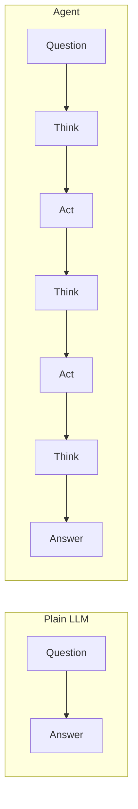

### LLM vs. Agent vs. Agentic System

| Concept | What It Is | Example |
|---------|-----------|---------|
| **LLM** | A model that generates text | GPT-4, Claude, Llama |
| **Agent** | LLM + tools + decision loop | A bot that searches the web then answers |
| **Agentic System** | Multiple agents working together | One agent researches, another writes, a third reviews |

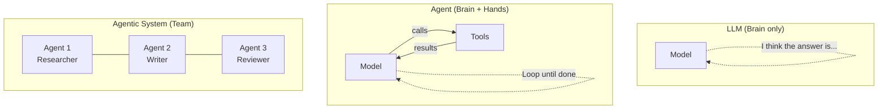

### Levels of Agency

Agency exists on a spectrum — from fully scripted workflows to fully autonomous agents:

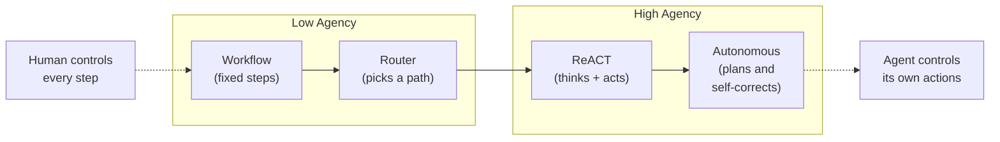

**Key Insight:** More agency = more flexibility, but also more risk of errors. Start simple and add agency only when needed.

---

## 2. Workflows

Workflows are **pre-defined patterns** for how an LLM processes information. The human designs the flow; the LLM executes each step.

### 2.1 Prompt Chaining

Run one LLM call, then feed its output into the next call.

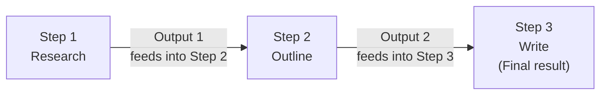

**Example: Summarize then Translate**

```python
import openai

client = openai.OpenAI()

# Step 1: Summarize
response1 = client.chat.completions.create(
    model="gpt-4o-mini",
    messages=[{"role": "user", "content": f"Summarize this article: {article_text}"}]
)
summary = response1.choices[0].message.content

# Step 2: Translate the summary
response2 = client.chat.completions.create(
    model="gpt-4o-mini",
    messages=[{"role": "user", "content": f"Translate to French: {summary}"}]
)
french_summary = response2.choices[0].message.content
```

**When to use:** When each step has a clear input/output and later steps depend on earlier ones.

---

### 2.2 Routing

The LLM decides which path to take based on the input.

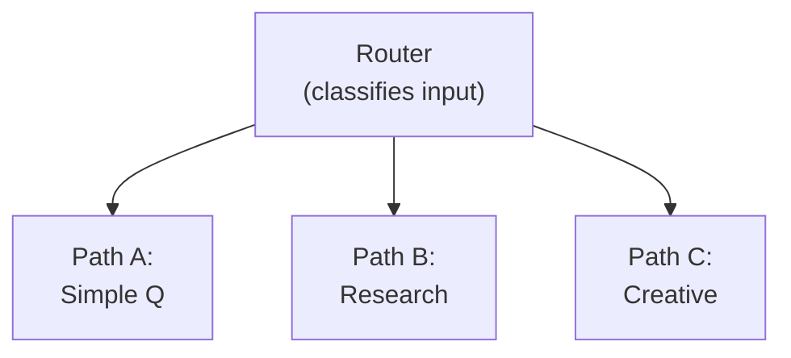

**Example:**

```python
def route_question(question):
    """Use LLM to classify the question and pick a handler."""
    response = client.chat.completions.create(
        model="gpt-4o-mini",
        messages=[{
            "role": "user",
            "content": f"""Classify this question into one category:
            - 'factual' (needs web search)
            - 'creative' (needs creative writing)
            - 'code' (needs code generation)

            Question: {question}
            Reply with just the category name."""
        }]
    )
    category = response.choices[0].message.content.strip()

    if category == "factual":
        return handle_factual(question)
    elif category == "creative":
        return handle_creative(question)
    else:
        return handle_code(question)
```

**When to use:** When different types of input need different processing strategies.

---

### 2.3 Parallelization

Run multiple LLM calls at the same time for speed or better results.

#### Sectioning (split work)

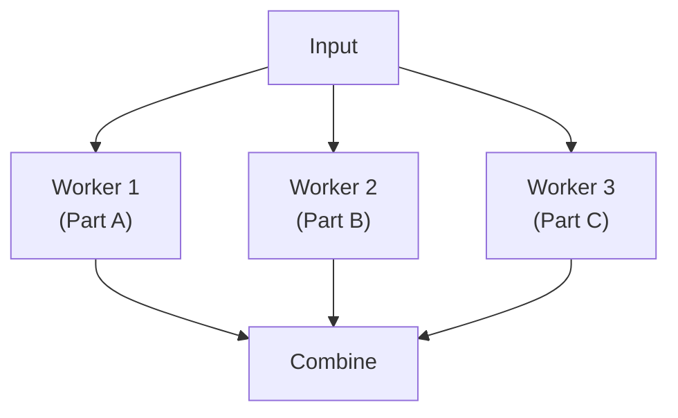

**Example:** Analyze a document from 3 angles simultaneously:

```python
import asyncio
import openai

client = openai.AsyncOpenAI()

async def analyze_parallel(document):
    """Analyze a document from multiple angles in parallel."""
    tasks = [
        client.chat.completions.create(
            model="gpt-4o-mini",
            messages=[{"role": "user", "content": f"List key facts in: {document}"}]
        ),
        client.chat.completions.create(
            model="gpt-4o-mini",
            messages=[{"role": "user", "content": f"What is the sentiment of: {document}"}]
        ),
        client.chat.completions.create(
            model="gpt-4o-mini",
            messages=[{"role": "user", "content": f"Summarize in 2 sentences: {document}"}]
        ),
    ]
    results = await asyncio.gather(*tasks)
    return [r.choices[0].message.content for r in results]
```

#### Voting (multiple opinions)

Run the same prompt multiple times and take the majority answer:

```python
async def vote_on_answer(question, num_votes=3):
    """Ask the same question multiple times and take majority answer."""
    tasks = [
        client.chat.completions.create(
            model="gpt-4o-mini",
            messages=[{"role": "user", "content": question}]
        )
        for _ in range(num_votes)
    ]
    results = await asyncio.gather(*tasks)
    answers = [r.choices[0].message.content for r in results]
    # Pick most common answer
    from collections import Counter
    return Counter(answers).most_common(1)[0][0]
```

---

### 2.4 Reflection

The LLM reviews and improves its own output.

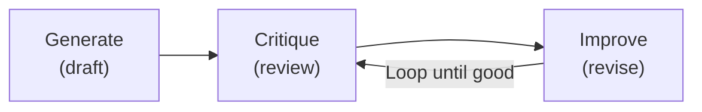

**Example:**

```python
def generate_with_reflection(task, max_iterations=3):
    """Generate content, then iteratively improve it."""
    # Step 1: Generate initial draft
    response = client.chat.completions.create(
        model="gpt-4o-mini",
        messages=[{"role": "user", "content": f"Write: {task}"}]
    )
    draft = response.choices[0].message.content

    for i in range(max_iterations):
        # Step 2: Critique
        critique_response = client.chat.completions.create(
            model="gpt-4o-mini",
            messages=[{"role": "user", "content": f"""
            Critique this writing. List specific problems:
            {draft}
            If it's good enough, say 'APPROVED'.
            """}]
        )
        critique = critique_response.choices[0].message.content

        if "APPROVED" in critique:
            break

        # Step 3: Improve based on critique
        improve_response = client.chat.completions.create(
            model="gpt-4o-mini",
            messages=[{"role": "user", "content": f"""
            Improve this writing based on the feedback:

            Original: {draft}
            Feedback: {critique}
            """}]
        )
        draft = improve_response.choices[0].message.content

    return draft
```

---

### 2.5 Orchestration-Worker

A central "orchestrator" LLM breaks down work and delegates to workers.

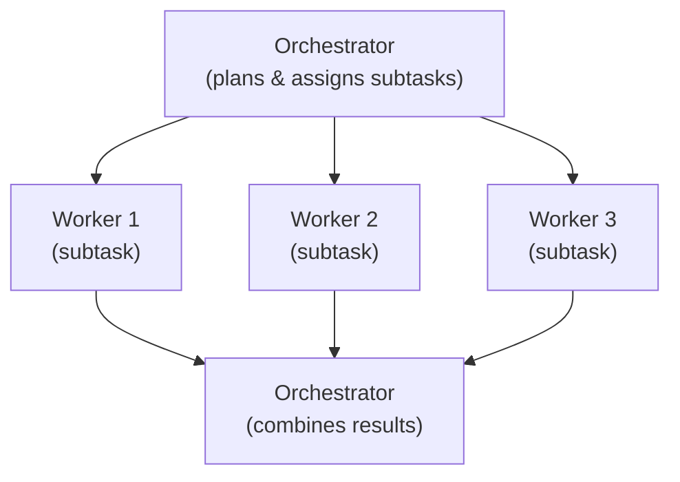

**Example:**

```python
def orchestrator(complex_question):
    """Break a complex question into subtasks and combine results."""
    # Plan subtasks
    plan_response = client.chat.completions.create(
        model="gpt-4o-mini",
        messages=[{"role": "user", "content": f"""
        Break this question into 2-3 simpler sub-questions:
        {complex_question}
        Return as a numbered list.
        """}]
    )
    subtasks = plan_response.choices[0].message.content

    # Execute each subtask (workers)
    worker_response = client.chat.completions.create(
        model="gpt-4o-mini",
        messages=[{"role": "user", "content": f"""
        Answer each sub-question:
        {subtasks}
        """}]
    )
    answers = worker_response.choices[0].message.content

    # Combine into final answer
    final_response = client.chat.completions.create(
        model="gpt-4o-mini",
        messages=[{"role": "user", "content": f"""
        Combine these answers into one coherent response:
        Original question: {complex_question}
        Sub-answers: {answers}
        """}]
    )
    return final_response.choices[0].message.content
```

---

## 3. Tools

### 3.1 What is Tool Calling?

Tool calling lets an LLM **request the use of external functions**. The LLM doesn't run the tool itself — it tells your program *which* tool to call and *what arguments* to pass.

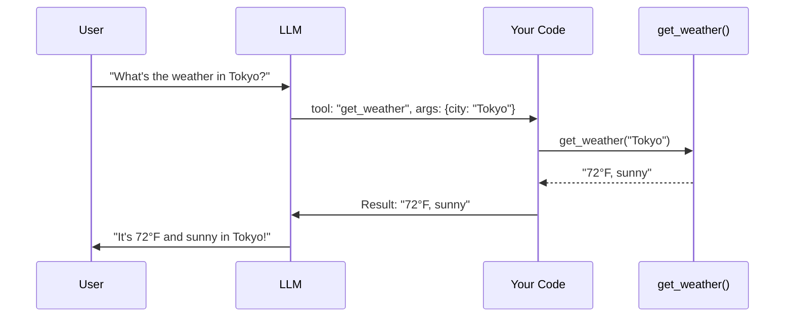

**Key Insight:** The LLM decides WHAT to do. Your code does the actual work.

---

### 3.2 Tool Formatting

Tools are described to the LLM using a specific JSON format:

```python
tools = [
    {
        "type": "function",
        "function": {
            "name": "search_web",
            "description": "Search the web for current information on a topic",
            "parameters": {
                "type": "object",
                "properties": {
                    "query": {
                        "type": "string",
                        "description": "The search query"
                    },
                    "num_results": {
                        "type": "integer",
                        "description": "Number of results to return (default: 5)"
                    }
                },
                "required": ["query"]
            }
        }
    }
]
```

**Parts of a tool definition:**

| Field | Purpose | Example |
|-------|---------|---------|
| `name` | Identifier for the tool | `"search_web"` |
| `description` | Tells the LLM when to use it | `"Search the web for..."` |
| `parameters` | What inputs the tool needs | `query`, `num_results` |
| `required` | Which parameters are mandatory | `["query"]` |

---

### 3.3 Tool Execution

Here's the complete flow for executing a tool call:

```python
import json

def run_conversation(user_message, tools):
    """Complete tool-calling loop."""
    messages = [{"role": "user", "content": user_message}]

    # Step 1: Send message to LLM with available tools
    response = client.chat.completions.create(
        model="gpt-4o-mini",
        messages=messages,
        tools=tools
    )

    message = response.choices[0].message

    # Step 2: Check if LLM wants to use a tool
    if message.tool_calls:
        messages.append(message)  # Add assistant's response to history

        # Step 3: Execute each tool call
        for tool_call in message.tool_calls:
            function_name = tool_call.function.name
            arguments = json.loads(tool_call.function.arguments)

            # Call the actual function
            result = call_function(function_name, arguments)

            # Step 4: Send result back to LLM
            messages.append({
                "role": "tool",
                "tool_call_id": tool_call.id,
                "content": str(result)
            })

        # Step 5: Get final response
        final_response = client.chat.completions.create(
            model="gpt-4o-mini",
            messages=messages,
            tools=tools
        )
        return final_response.choices[0].message.content

    return message.content


def call_function(name, args):
    """Dispatch to the actual function implementation."""
    if name == "search_web":
        return search_web(args["query"], args.get("num_results", 5))
    elif name == "get_weather":
        return get_weather(args["city"])
    else:
        return f"Unknown function: {name}"
```

---

### 3.4 MCP (Model Context Protocol)

MCP is a **standardized way** to connect LLMs to external tools and data sources. Think of it as a "USB port" for AI — any tool that speaks MCP can plug into any LLM that supports it.

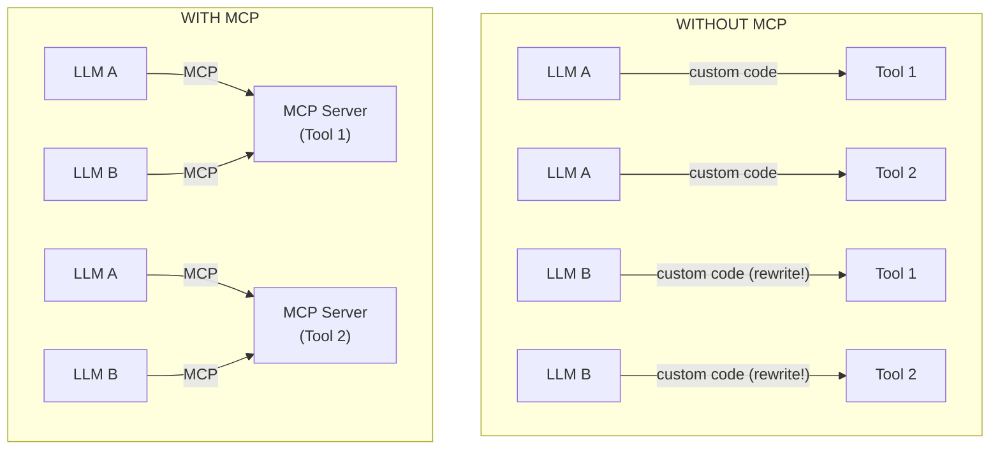

**MCP Components:**

| Component | Role | Analogy |
|-----------|------|---------|
| **MCP Host** | The application (IDE, chatbot) | Your computer |
| **MCP Client** | Connects host to servers | USB cable |
| **MCP Server** | Provides tools/resources | USB device |

**Why MCP Matters:**
- Tools are reusable across different LLMs
- Standard format means less custom code
- Growing ecosystem of pre-built MCP servers

---

## 4. Multi-Step Agents

Multi-step agents can **plan and execute multiple actions** autonomously. They decide what to do next based on what they've learned so far.

### 4.1 Planning Autonomy

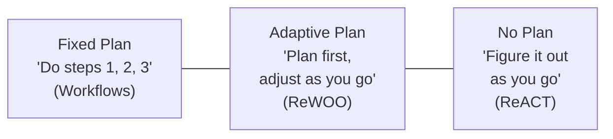

---

### 4.2 ReACT (Reasoning + Acting)

ReACT is the most popular agent pattern. The agent alternates between **thinking** (reasoning) and **doing** (acting).

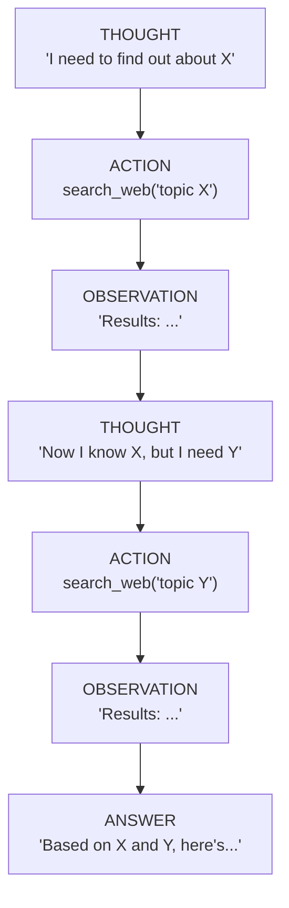

**Simple ReACT Example:**

```python
def react_agent(question, tools, max_steps=5):
    """A simple ReACT agent that thinks and acts in a loop."""
    messages = [
        {"role": "system", "content": """You are a helpful assistant.
        Think step by step. Use tools when you need information.
        When you have enough info, provide a final answer."""},
        {"role": "user", "content": question}
    ]

    for step in range(max_steps):
        response = client.chat.completions.create(
            model="gpt-4o-mini",
            messages=messages,
            tools=tools
        )
        message = response.choices[0].message

        # If no tool calls, agent is done — return answer
        if not message.tool_calls:
            return message.content

        # Execute tool calls (Action)
        messages.append(message)
        for tool_call in message.tool_calls:
            result = execute_tool(tool_call)
            messages.append({
                "role": "tool",
                "tool_call_id": tool_call.id,
                "content": result
            })
        # Loop back — LLM will Observe and Reason next

    return "Agent reached max steps without a final answer."
```

---

### 4.3 Reflexion

Reflexion adds **self-evaluation** to the agent loop. After acting, the agent asks itself: "Did that work? What should I do differently?"

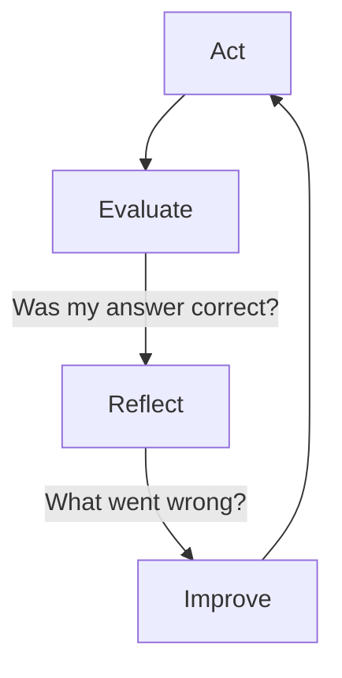

```python
def reflexion_agent(question, max_attempts=3):
    """Agent that reflects on and improves its answers."""
    memory = []  # Store past reflections

    for attempt in range(max_attempts):
        # Generate answer (with past reflections as context)
        answer = generate_answer(question, memory)

        # Evaluate the answer
        evaluation = evaluate_answer(question, answer)

        if evaluation["is_correct"]:
            return answer

        # Reflect on what went wrong
        reflection = reflect(question, answer, evaluation["feedback"])
        memory.append(reflection)

    return answer  # Return best attempt
```

---

### 4.4 ReWOO (Reasoning Without Observation)

ReWOO plans ALL actions upfront before executing any of them. This saves tokens and time.

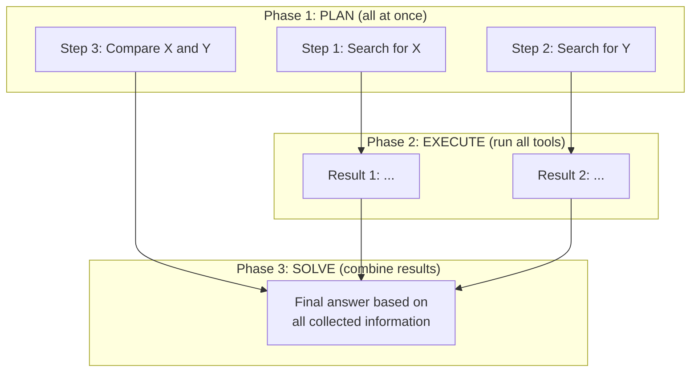

**Comparison: ReACT vs ReWOO**

| Feature | ReACT | ReWOO |
|---------|-------|-------|
| Planning | Step by step | All upfront |
| LLM calls | Many (think-act-observe loop) | Few (plan, then solve) |
| Adaptability | High (adjusts after each step) | Lower (fixed plan) |
| Token usage | Higher | Lower |
| Best for | Complex, uncertain tasks | Straightforward multi-step tasks |

---

### 4.5 Tree Search for Agents

When there are many possible paths, agents can explore multiple options like a tree:

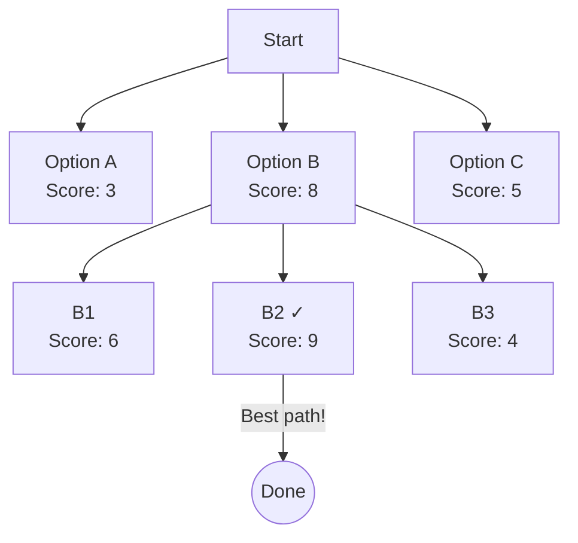

**Concepts:**
- **Branching:** Try multiple approaches at each step
- **Scoring:** Rate how promising each branch is
- **Pruning:** Abandon low-scoring branches early
- **Backtracking:** If stuck, go back and try a different path

This is useful for complex reasoning tasks like math proofs or code generation.

---

## 5. Multi-Agent Systems

### 5.1 What Are Multi-Agent Systems?

Multiple specialized agents collaborating on a task, each with their own role and tools.

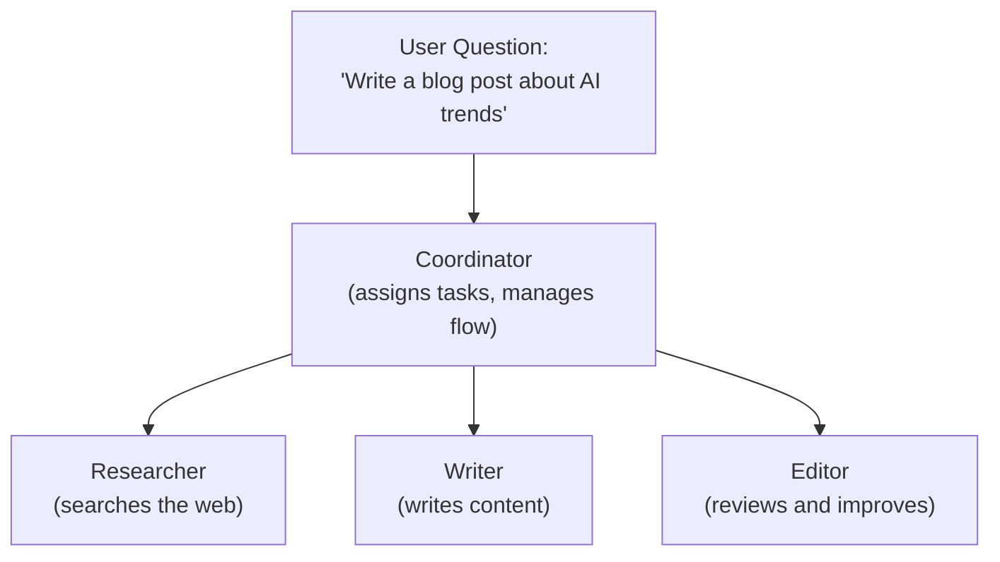

### 5.2 Challenges

| Challenge | Description |
|-----------|-------------|
| **Communication** | Agents need a clear protocol to share information |
| **Coordination** | Who does what? How to avoid duplicate work? |
| **Error propagation** | One agent's mistake can cascade to others |
| **Debugging** | Hard to trace what went wrong in a multi-agent system |
| **Cost** | More agents = more LLM calls = higher cost |

### 5.3 Use Cases

- **Software Development:** Coder + Tester + Reviewer
- **Research:** Searcher + Analyzer + Writer
- **Customer Support:** Router + Specialist agents for different topics
- **Data Processing:** Extractor + Transformer + Validator

### 5.4 A2A Protocol (Agent-to-Agent)

A2A is a **standard protocol** (by Google) for agents to communicate with each other, similar to how MCP standardizes tool access.

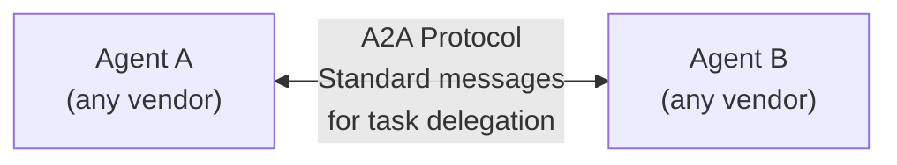

**Key concepts:**
- **Agent Card:** describes what an agent can do
- **Task:** unit of work with lifecycle (submitted → working → completed)
- **Message/Part:** structured communication

**MCP vs A2A:**
- **MCP** = LLM ↔ Tool (like calling a function)
- **A2A** = Agent ↔ Agent (like collaborating with a colleague)

---

## 6. Agent Evaluation

How do you know if your agent works well? Here are key metrics:

### Evaluation Dimensions

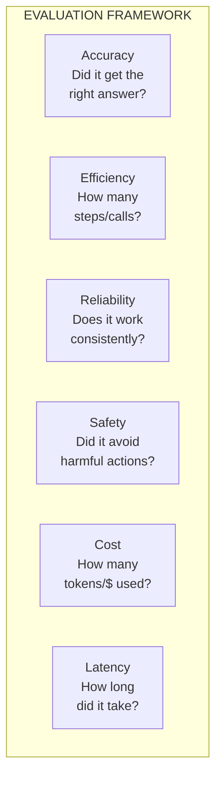

### Evaluation Methods

| Method | How It Works | Best For |
|--------|-------------|----------|
| **Human evaluation** | People judge agent outputs | Quality, safety |
| **LLM-as-judge** | Another LLM grades the output | Scale, consistency |
| **Automated metrics** | Compare to known answers | Factual accuracy |
| **Trajectory analysis** | Review the steps taken | Efficiency, debugging |

### Simple Evaluation Example

```python
def evaluate_agent(agent, test_cases):
    """Run agent on test cases and measure performance."""
    results = []

    for test in test_cases:
        import time
        start = time.time()

        answer = agent(test["question"])

        elapsed = time.time() - start

        # Check correctness (simple keyword match)
        is_correct = any(
            keyword.lower() in answer.lower()
            for keyword in test["expected_keywords"]
        )

        results.append({
            "question": test["question"],
            "correct": is_correct,
            "time_seconds": elapsed,
            "answer_length": len(answer)
        })

    # Summary
    accuracy = sum(r["correct"] for r in results) / len(results)
    avg_time = sum(r["time_seconds"] for r in results) / len(results)

    print(f"Accuracy: {accuracy:.0%}")
    print(f"Avg time: {avg_time:.1f}s")

    return results
```

---

## 7. Glossary

| Term | Definition |
|------|-----------|
| **Agent** | A program that uses an LLM to decide what actions to take |
| **Agentic System** | Multiple agents working together on a task |
| **LLM** | Large Language Model — the AI brain (e.g., GPT-4, Claude) |
| **Tool** | A function the LLM can ask to be called (search, calculator, etc.) |
| **Tool Calling** | The LLM's ability to request function execution |
| **MCP** | Model Context Protocol — standard for connecting LLMs to tools |
| **A2A** | Agent-to-Agent protocol — standard for agent communication |
| **ReACT** | Reasoning + Acting — agent thinks then acts in a loop |
| **Reflexion** | Agent pattern that includes self-evaluation and improvement |
| **ReWOO** | Reasoning Without Observation — plan all steps before executing |
| **Prompt Chaining** | Output of one LLM call feeds into the next |
| **Routing** | LLM classifies input and picks the right handler |
| **Parallelization** | Running multiple LLM calls simultaneously |
| **Orchestrator** | A central agent that delegates work to other agents |
| **Observation** | The result returned after an agent uses a tool |
| **Token** | A chunk of text (~4 characters) — LLM pricing unit |
| **Context Window** | Maximum amount of text an LLM can process at once |
| **Trajectory** | The sequence of steps an agent took to reach an answer |
| **Grounding** | Connecting LLM responses to real-world data (web, docs) |

---

## Summary Diagram: How It All Fits Together

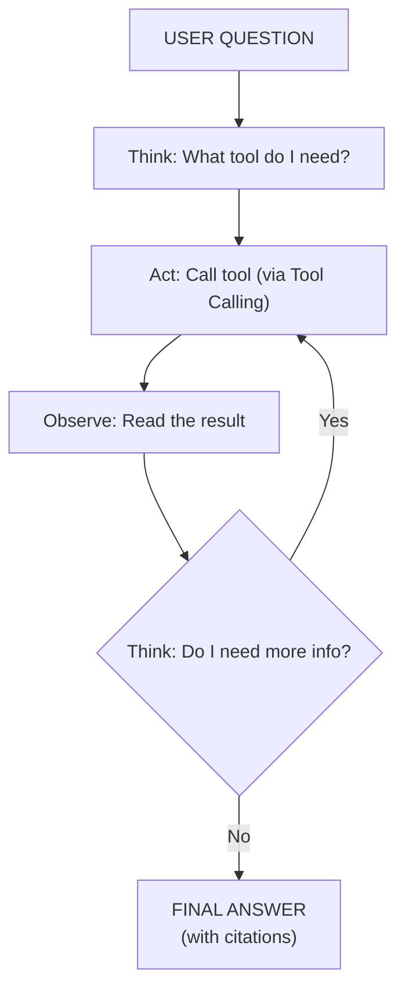

---

## Next Steps

Ready to build? Head to [PROJECT.md](./PROJECT.md) to build your own "Ask-the-Web" agent step by step!
