# Project 4: Deep Research Capability with Web Search and Reasoning Models

## Learning Material — A Beginner's Guide

---

## Table of Contents

1. [Introduction](#introduction)
2. [Reasoning and Thinking LLMs](#reasoning-and-thinking-llms)
3. [Inference-Time Techniques](#inference-time-techniques)
4. [Training-Time Techniques](#training-time-techniques)
5. [Local Deployment](#local-deployment)
6. [Glossary](#glossary)

---

## Introduction

Imagine you ask a friend a hard question. A regular friend might blurt out an answer immediately.
A *thoughtful* friend pauses, considers multiple angles, checks their reasoning, and then gives
you a well-considered answer. **Reasoning LLMs** are like that thoughtful friend — they "think"
before answering.

This guide will teach you:
- What reasoning models are and why they matter
- How they think harder at inference time (when answering)
- How they learn to reason during training time
- How to run them locally on your own computer

No prior AI/ML knowledge is assumed. Let's begin!

---

## Reasoning and Thinking LLMs

### What Is a Reasoning Model?

A standard LLM generates text word-by-word, like autocomplete on steroids. A **reasoning model**
adds an extra step: it generates intermediate "thinking" steps before producing a final answer.

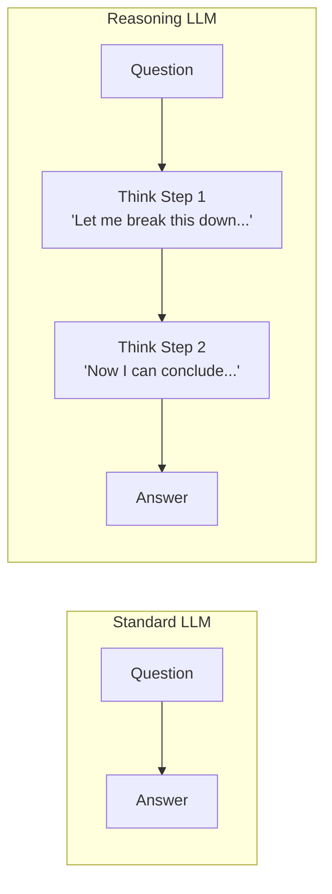

### Key Reasoning Models

#### OpenAI "o" Family (o1, o3, o4-mini)

OpenAI's "o" series models are designed to reason before answering. They:
- Generate hidden "thinking tokens" before the visible response
- Spend more compute on harder problems (inference-time scaling)
- Excel at math, coding, and scientific reasoning

```python
# Using an OpenAI reasoning model
from openai import OpenAI

client = OpenAI()

response = client.chat.completions.create(
    model="o4-mini",  # A reasoning model
    messages=[
        {"role": "user", "content": "What is 27 * 43 + 15 / 3?"}
    ]
)
# The model internally "thinks" through the arithmetic steps
# before giving the final answer: 1166
print(response.choices[0].message.content)
```

**How it works internally** (simplified):

```
User: What is 27 * 43 + 15 / 3?

[Hidden thinking tokens - you don't see these]
  "Let me solve this step by step.
   First: 27 * 43 = 1161
   Then: 15 / 3 = 5
   Finally: 1161 + 5 = 1166"

Visible output: The answer is 1166.
```

#### DeepSeek-R1

DeepSeek-R1 is an open-source reasoning model. Unlike OpenAI's models, its thinking
process is visible in a `<think>` block:

```
User: Is 9677 a prime number?

DeepSeek-R1 output:
<think>
I need to check if 9677 is prime.
Let me try dividing by small primes.
9677 / 2 = not integer (it's odd)
9677 / 3 = 3225.67... no
9677 / 7 = 1382.4... no
...
9677 / 97 = 99.76... no
√9677 ≈ 98.3, so I only need to check up to 98.
None of the primes up to 98 divide 9677 evenly.
</think>

Yes, 9677 is a prime number.
```

**Why DeepSeek-R1 matters:**
- It's open-source (you can download and run it)
- The thinking is transparent (you can see the reasoning)
- It can run locally on your own hardware

### Comparison Table

| Feature          | Standard LLM | OpenAI o-series | DeepSeek-R1 |
|------------------|-------------|-----------------|-------------|
| Thinking visible | No thinking | Hidden          | Visible     |
| Open source      | Varies      | No              | Yes         |
| Run locally      | Some        | No              | Yes         |
| Cost per query   | Low         | High            | Free/local  |
| Best for         | Simple tasks| Hard problems   | Hard probs  |

---

## Inference-Time Techniques

"Inference time" = when the model is answering your question (not during training).
These techniques make models think harder *at the moment you ask them something*.

### 1. Inference-Time Scaling

**Core Idea:** Spend more computation on harder problems.

Think of it like a student on an exam:
- Easy question → answer quickly
- Hard question → spend more time thinking

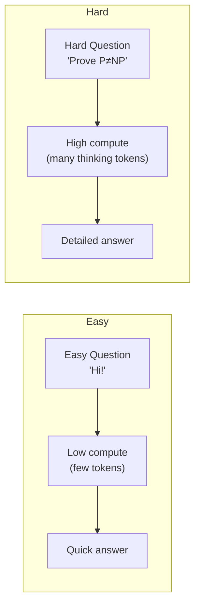

**Why it matters:** Instead of making a bigger model (expensive to train), you can make
an existing model think longer on hard problems. This is often cheaper and more flexible.

```python
# Conceptual example: controlling "thinking effort"
response = client.chat.completions.create(
    model="o4-mini",
    reasoning_effort="high",  # Tell model to think harder
    messages=[
        {"role": "user", "content": "Solve this complex math proof..."}
    ]
)
```

### 2. Chain-of-Thought (CoT) Prompting

**Core Idea:** Ask the model to show its work, step by step.

This is the simplest reasoning technique — you just add "think step by step" to your prompt!

```python
# WITHOUT Chain-of-Thought
prompt = "If a store has 3 shelves with 8 books each, and 5 books are sold, how many remain?"
# Model might jump to wrong answer

# WITH Chain-of-Thought
prompt = """If a store has 3 shelves with 8 books each, and 5 books are sold, 
how many remain?

Think step by step."""
# Model output:
# Step 1: 3 shelves × 8 books = 24 books total
# Step 2: 24 - 5 sold = 19 books remain
# Answer: 19
```

**How CoT works:**

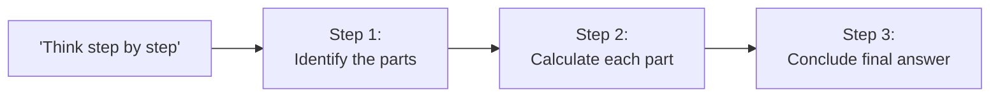

**Types of CoT:**

| Type | Description | Example |
|------|-------------|---------|
| Zero-shot CoT | Just say "think step by step" | "Solve this. Think step by step." |
| Few-shot CoT | Show examples of step-by-step reasoning | Provide worked examples in prompt |

```python
# Few-shot CoT example
few_shot_prompt = """
Q: Roger has 5 tennis balls. He buys 2 cans of 3 balls each. How many does he have?
A: Roger starts with 5 balls. He buys 2 cans × 3 balls = 6 balls. Total: 5 + 6 = 11.

Q: The cafeteria had 23 apples. They used 20 and bought 6 more. How many do they have?
A: Started with 23. Used 20, so 23 - 20 = 3. Bought 6 more: 3 + 6 = 9.

Q: A baker has 4 trays with 12 cookies each. He gives away 15. How many remain?
A:"""
# The model learns the pattern and solves step-by-step
```

### 3. Parallel Sampling (Self-Consistency)

**Core Idea:** Generate multiple answers independently, then pick the most common one.

Like asking 10 different people the same question and going with the majority answer.

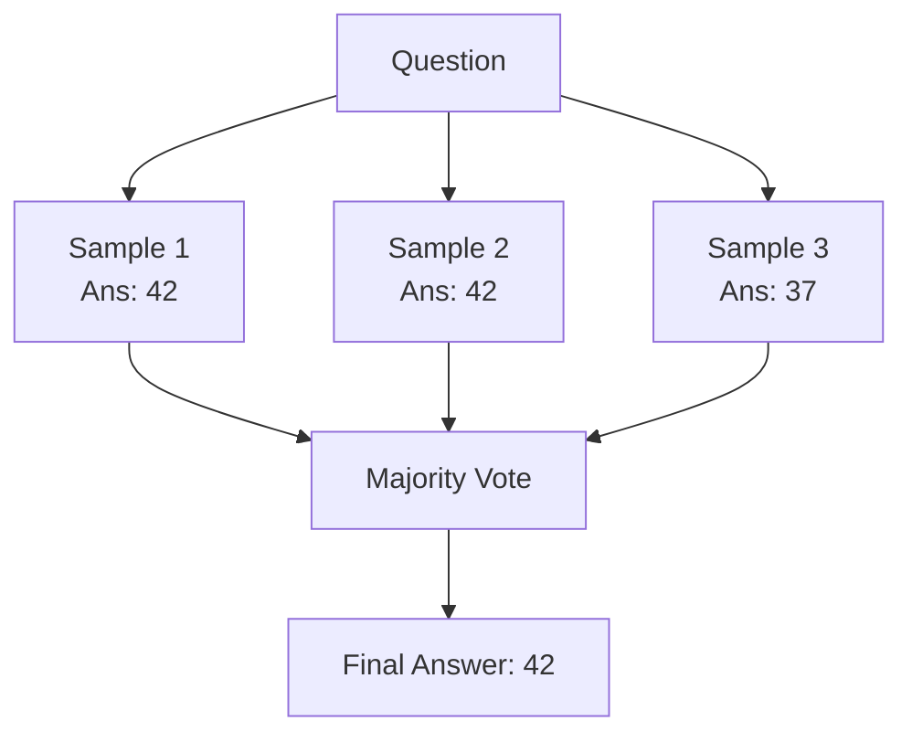

```python
import collections

def parallel_sampling(client, question, num_samples=5):
    """Generate multiple answers and pick the most common one."""
    answers = []
    
    for _ in range(num_samples):
        response = client.chat.completions.create(
            model="gpt-4.1",
            temperature=0.7,  # Add randomness for diversity
            messages=[
                {"role": "user", "content": f"{question}\nThink step by step."}
            ]
        )
        answers.append(response.choices[0].message.content)
    
    # Count the most common final answer
    # (In practice, you'd extract just the final answer from each response)
    counter = collections.Counter(answers)
    best_answer = counter.most_common(1)[0][0]
    return best_answer
```

### 4. Sequential Sampling (Refinement)

**Core Idea:** Generate an answer, then improve it iteratively.

Like writing an essay draft, then revising it multiple times.

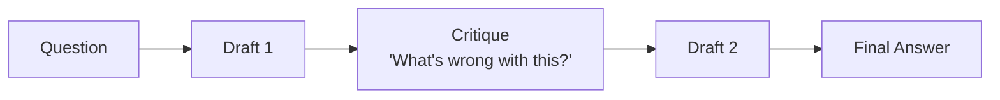

```python
def sequential_refinement(client, question, rounds=3):
    """Iteratively refine an answer."""
    
    # Round 1: Initial answer
    messages = [
        {"role": "user", "content": f"{question}\nThink step by step."}
    ]
    response = client.chat.completions.create(model="gpt-4.1", messages=messages)
    current_answer = response.choices[0].message.content
    
    # Subsequent rounds: Critique and improve
    for i in range(rounds - 1):
        messages = [
            {"role": "user", "content": question},
            {"role": "assistant", "content": current_answer},
            {"role": "user", "content": 
                "Review your answer. Are there any errors or improvements? "
                "Provide a corrected, improved version."}
        ]
        response = client.chat.completions.create(model="gpt-4.1", messages=messages)
        current_answer = response.choices[0].message.content
    
    return current_answer
```

### 5. Tree of Thoughts (ToT)

**Core Idea:** Explore multiple reasoning paths simultaneously, like a tree branching out.
Evaluate each branch and pursue the most promising ones.

This is more powerful than linear CoT because the model can *backtrack* if a path isn't working.

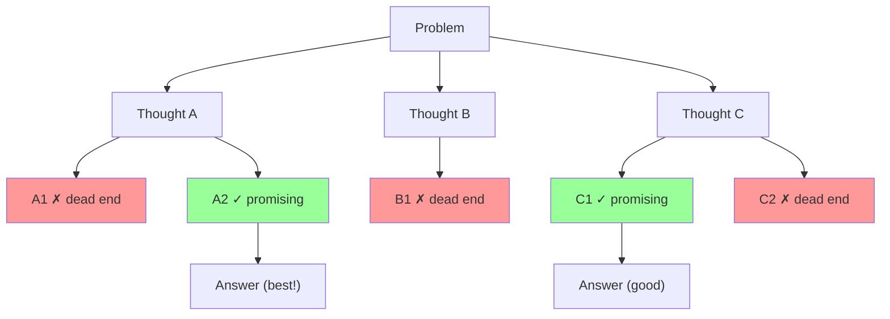

```python
def tree_of_thoughts(client, problem, breadth=3, depth=2):
    """
    Explore multiple reasoning paths and pick the best.
    
    breadth = how many branches to explore at each level
    depth = how many levels deep to go
    """
    
    def generate_thoughts(context):
        """Generate multiple next-step thoughts."""
        response = client.chat.completions.create(
            model="gpt-4.1",
            temperature=0.8,
            n=breadth,  # Generate multiple completions
            messages=[{
                "role": "user",
                "content": f"""Problem: {problem}
                
Progress so far: {context}

Generate ONE next reasoning step. Be specific and concrete."""
            }]
        )
        return [c.message.content for c in response.choices]
    
    def evaluate_thought(thought):
        """Score how promising a thought path is (1-10)."""
        response = client.chat.completions.create(
            model="gpt-4.1",
            messages=[{
                "role": "user",
                "content": f"""Problem: {problem}

Reasoning so far: {thought}

Rate this reasoning path from 1-10. 
Is it making progress toward a solution?
Reply with just a number."""
            }]
        )
        try:
            return int(response.choices[0].message.content.strip())
        except ValueError:
            return 5
    
    # Start with initial thoughts
    current_paths = generate_thoughts("None yet - this is the first step.")
    
    for level in range(depth - 1):
        # Evaluate all current paths
        scored_paths = [(path, evaluate_thought(path)) for path in current_paths]
        
        # Keep only the best paths
        scored_paths.sort(key=lambda x: x[1], reverse=True)
        best_paths = [p[0] for p in scored_paths[:breadth]]
        
        # Expand the best paths
        next_paths = []
        for path in best_paths:
            new_thoughts = generate_thoughts(path)
            next_paths.extend([f"{path}\n→ {t}" for t in new_thoughts])
        
        current_paths = next_paths
    
    # Final evaluation - pick the best path
    scored_final = [(path, evaluate_thought(path)) for path in current_paths]
    scored_final.sort(key=lambda x: x[1], reverse=True)
    best_reasoning = scored_final[0][0]
    
    # Generate final answer from best reasoning path
    response = client.chat.completions.create(
        model="gpt-4.1",
        messages=[{
            "role": "user",
            "content": f"""Problem: {problem}

Best reasoning path:
{best_reasoning}

Based on this reasoning, provide a clear final answer."""
        }]
    )
    
    return response.choices[0].message.content
```

### 6. Search Against a Verifier

**Core Idea:** Generate many candidate answers, then use a separate "verifier" model
to check which one is correct.

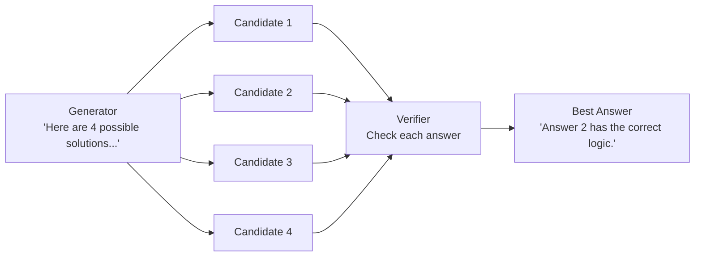

```python
def search_with_verifier(client, problem, num_candidates=5):
    """Generate candidates and verify the best one."""
    
    # Step 1: Generate multiple candidate solutions
    candidates = []
    for _ in range(num_candidates):
        response = client.chat.completions.create(
            model="gpt-4.1",
            temperature=0.9,
            messages=[{
                "role": "user", 
                "content": f"Solve this problem. Show your work.\n\n{problem}"
            }]
        )
        candidates.append(response.choices[0].message.content)
    
    # Step 2: Verify each candidate
    verification_prompt = f"""Problem: {problem}

I have {len(candidates)} candidate solutions. 
For each one, check if the logic is correct and the answer is right.
Then tell me which solution number is best.

"""
    for i, candidate in enumerate(candidates, 1):
        verification_prompt += f"--- Solution {i} ---\n{candidate}\n\n"
    
    verification_prompt += "Which solution is correct? Reply with the number."
    
    response = client.chat.completions.create(
        model="gpt-4.1",
        messages=[{"role": "user", "content": verification_prompt}]
    )
    
    # Return the verified best answer
    return response.choices[0].message.content
```

---

## Training-Time Techniques

These techniques happen *before* the model reaches you — during the training phase.
Understanding them helps you pick the right model and understand their strengths.

### 1. SFT on Reasoning Data (STaR)

**SFT** = Supervised Fine-Tuning (training a model on examples)
**STaR** = Self-Taught Reasoner

**Core Idea:** Train the model on examples of good reasoning. If it gets an answer
wrong, show it the correct answer and ask it to generate reasoning that leads there.

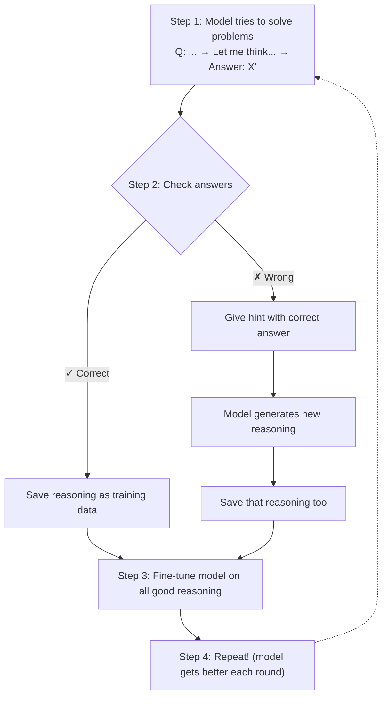

**Simple analogy:** A student solves practice problems. For ones they get right, they
keep their method. For ones they get wrong, the teacher shows the answer and the
student figures out how they *should have* solved it. Then they practice all those methods.

```python
# Pseudocode showing the STaR concept
def star_training_loop(model, problems):
    training_data = []
    
    for problem in problems:
        # Model attempts the problem
        reasoning, answer = model.solve(problem)
        
        if answer == problem.correct_answer:
            # Good reasoning! Save it.
            training_data.append((problem, reasoning))
        else:
            # Wrong answer. Give a hint and try again.
            reasoning_with_hint = model.solve_with_hint(
                problem, 
                hint=f"The correct answer is {problem.correct_answer}"
            )
            training_data.append((problem, reasoning_with_hint))
    
    # Fine-tune model on all collected reasoning
    model.fine_tune(training_data)
    return model
```

### 2. Reinforcement Learning with a Verifier

**Core Idea:** Instead of showing the model *how* to reason, reward it when it gets
the right answer and let it figure out reasoning strategies on its own.

```mermaid
graph TD
    M[Model generates solution] --> V[Verifier checks answer]
    V --> R["Reward Signal\n+1 / -1"]
    R --> U[Model updates strategy\nto get more rewards]
    U -.-> M
```

This is how DeepSeek-R1 was trained! The model learned reasoning strategies (like
breaking problems into steps) purely from the reward signal, without being shown examples.

### 3. Reward Modeling (ORM and PRM)

Two ways to evaluate model responses:

**ORM (Outcome Reward Model):** Only checks the final answer.
- "Did you get 42? Yes → reward. No → penalty."

**PRM (Process Reward Model):** Checks each reasoning step.
- "Step 1 correct? ✓ Step 2 correct? ✓ Step 3 wrong? ✗"

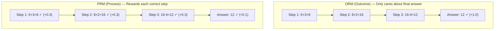

**PRM is better because:**
- It catches errors at the step where they happen
- It can guide the model to better reasoning paths
- It provides more learning signal (feedback on every step, not just the end)

### 4. Self-Refinement

**Core Idea:** Train the model to critique and improve its own outputs.

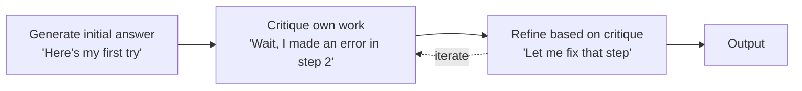

During training, the model learns to:
1. Generate an initial response
2. Identify weaknesses or errors in that response
3. Produce an improved version

### 5. Internalizing Search (Meta-CoT)

**Core Idea:** Instead of needing external search procedures (like Tree of Thoughts
run by code), train the model to do that exploration *internally* in its own thinking.

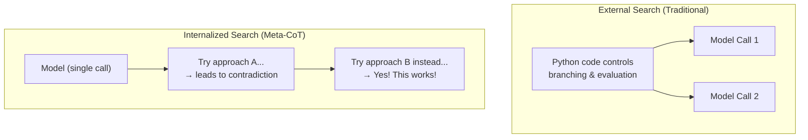

This is what OpenAI's o-series models do — they've been trained to explore, backtrack,
and evaluate different reasoning paths all within a single forward pass. No external
orchestration code needed.

---

## Local Deployment

You can run reasoning models on your own computer using **Ollama**.

### What is Ollama?

Ollama is a tool that lets you download and run LLMs locally. Think of it as
"Docker for AI models."

### Setup

```bash
# 1. Install Ollama (visit https://ollama.ai)
# On Windows: Download the installer
# On Mac: brew install ollama
# On Linux: curl -fsSL https://ollama.ai/install.sh | sh

# 2. Start the Ollama server
ollama serve

# 3. Pull a reasoning model
ollama pull deepseek-r1:8b      # 8B parameter version (needs ~6GB RAM)
ollama pull deepseek-r1:14b     # 14B version (needs ~10GB RAM)
ollama pull deepseek-r1:32b     # 32B version (needs ~20GB RAM)
```

### Using Ollama with Python

```python
import requests

def query_local_model(prompt, model="deepseek-r1:8b"):
    """Query a locally-running reasoning model."""
    response = requests.post(
        "http://localhost:11434/api/generate",
        json={
            "model": model,
            "prompt": prompt,
            "stream": False
        }
    )
    return response.json()["response"]

# Example usage
answer = query_local_model("What is 15% of 240? Think step by step.")
print(answer)
```

### Using Ollama with OpenAI-compatible API

Ollama provides an OpenAI-compatible endpoint, so you can use the same code:

```python
from openai import OpenAI

# Point to local Ollama server instead of OpenAI
client = OpenAI(
    base_url="http://localhost:11434/v1",
    api_key="ollama"  # Ollama doesn't need a real key
)

response = client.chat.completions.create(
    model="deepseek-r1:8b",
    messages=[
        {"role": "user", "content": "Explain why the sky is blue."}
    ]
)
print(response.choices[0].message.content)
```

### Hardware Requirements

| Model Size   | RAM Needed | Good For                  |
|-------------|------------|---------------------------|
| 1.5B params | ~2 GB      | Simple tasks, testing     |
| 8B params   | ~6 GB      | General use, good quality |
| 14B params  | ~10 GB     | Better reasoning          |
| 32B params  | ~20 GB     | Near-API quality          |
| 70B params  | ~40 GB     | Best local quality        |

Note: GPU (VRAM) is preferred but CPU-only works (just slower).
A gaming GPU with 8GB+ VRAM handles 8B models well.

---

## Glossary

| Term | Definition |
|------|-----------|
| **LLM** | Large Language Model — an AI trained on text that can generate text |
| **Inference** | The process of a model generating output (answering a question) |
| **Training** | The process of teaching a model from data (happens before you use it) |
| **Token** | A chunk of text (roughly ¾ of a word). Models process text as tokens |
| **CoT** | Chain-of-Thought — reasoning step by step |
| **ToT** | Tree of Thoughts — exploring multiple reasoning paths |
| **SFT** | Supervised Fine-Tuning — training on curated examples |
| **RL** | Reinforcement Learning — learning from rewards/penalties |
| **ORM** | Outcome Reward Model — judges only the final answer |
| **PRM** | Process Reward Model — judges each reasoning step |
| **STaR** | Self-Taught Reasoner — model generates its own training data |
| **Inference-time scaling** | Spending more compute on harder problems at query time |
| **Verifier** | A model or function that checks if an answer is correct |
| **Temperature** | Controls randomness in generation (0=deterministic, 1=creative) |
| **Ollama** | Tool for running LLMs locally on your computer |
| **DeepSeek-R1** | Open-source reasoning model with visible thinking |
| **OpenAI o-series** | Proprietary reasoning models (o1, o3, o4-mini) |
| **Meta-CoT** | Internalized search — model explores paths without external code |
| **Self-consistency** | Generating multiple answers and taking the majority vote |
| **Backtracking** | Abandoning a wrong reasoning path and trying a different one |

---

## Further Reading

- [OpenAI: Learning to Reason](https://openai.com/index/learning-to-reason-with-llms/)
- [DeepSeek-R1 Paper](https://arxiv.org/abs/2501.12948)
- [Tree of Thoughts Paper](https://arxiv.org/abs/2305.10601)
- [STaR Paper](https://arxiv.org/abs/2203.14465)
- [Ollama Documentation](https://ollama.ai)
- [Scaling LLM Test-Time Compute](https://arxiv.org/abs/2408.03314)
