# Project 5: Multi-modal Generation Agent — Learning Material

## Table of Contents

1. [Introduction](#introduction)
2. [Overview of Image and Video Generation](#overview-of-image-and-video-generation)
3. [Text-to-Image (T2I)](#text-to-image-t2i)
4. [Text-to-Video (T2V)](#text-to-video-t2v)
5. [Glossary](#glossary)
6. [Further Reading](#further-reading)

---

## Introduction

This guide teaches you how modern AI systems generate images and videos from text descriptions. By the end, you'll understand the core architectures and training methods behind tools like Stable Diffusion, DALL·E, and Sora.

**No prior knowledge of generative AI is assumed.** We start from the basics.

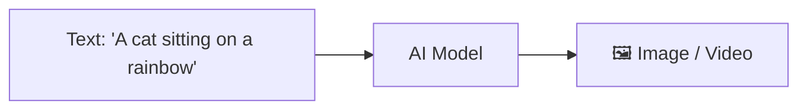

---

## Overview of Image and Video Generation

There are four main families of generative models. Let's explore each one.

### 1. Variational Autoencoders (VAE)

A VAE learns to compress data into a small "latent" representation and then reconstruct it.

**How it works:**

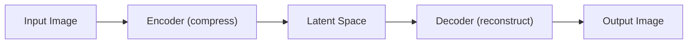

**Key idea:** The latent space is a compact, smooth representation. By sampling different points in this space, you can generate new images.

**Simple analogy:** Think of a VAE like a zip file. The encoder compresses the image, and the decoder unzips it back. But unlike a zip file, you can modify the compressed version to create new images!

```python
# Conceptual VAE (simplified pseudocode)
class VAE:
    def encode(self, image):
        """Compress image to a small latent vector"""
        mean = self.encoder_mean(image)
        std = self.encoder_std(image)
        # Sample from a distribution (the "variational" part)
        latent = mean + std * random_noise()
        return latent

    def decode(self, latent):
        """Reconstruct image from latent vector"""
        return self.decoder(latent)
```

**Strengths:** Fast generation, smooth latent space  
**Weaknesses:** Images can be blurry

---

### 2. Generative Adversarial Networks (GANs)

A GAN uses two networks that compete against each other like a forger and a detective.

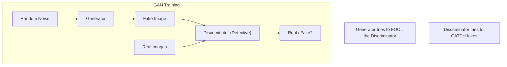

**Key idea:** The Generator gets better at creating realistic images because the Discriminator keeps catching its fakes. Eventually, the Generator produces images so realistic that the Discriminator can't tell them apart from real ones.

```python
# Conceptual GAN training loop (pseudocode)
for epoch in range(num_epochs):
    # Step 1: Train Discriminator
    real_images = get_real_batch()
    fake_images = generator(random_noise())

    d_loss = discriminator_loss(real_images, fake_images)
    update_discriminator(d_loss)

    # Step 2: Train Generator
    fake_images = generator(random_noise())
    # Generator wants discriminator to say "real"
    g_loss = generator_loss(fake_images)
    update_generator(g_loss)
```

**Strengths:** Very sharp, realistic images  
**Weaknesses:** Hard to train (mode collapse), less diversity

---

### 3. Auto-regressive Models

Auto-regressive models generate images one piece at a time, like writing a sentence word by word.

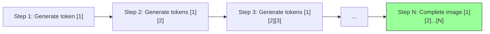

> Each step depends on **all** previous steps.

**Key idea:** The model predicts the next piece based on everything it's already generated. This is the same principle behind GPT (for text), applied to images.

**Image tokenization:** Images are first converted into a sequence of discrete tokens (like words), then generated one token at a time.

```python
# Conceptual auto-regressive generation (pseudocode)
def generate_image(prompt):
    tokens = encode_text(prompt)  # Text conditioning
    image_tokens = []

    for i in range(num_image_tokens):
        # Predict next token given all previous tokens
        next_token = model.predict_next(tokens + image_tokens)
        image_tokens.append(next_token)

    return decode_tokens_to_image(image_tokens)
```

**Strengths:** Can model complex distributions, unified with language models  
**Weaknesses:** Slow generation (sequential), may lose global coherence

---

### 4. Diffusion Models ⭐ (Most Important for This Project)

Diffusion models learn to generate images by learning to **remove noise**. This is currently the most successful approach.

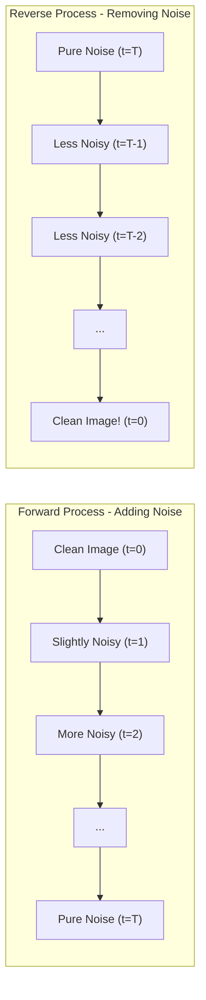

> The model learns: "Given this noisy image, what does the slightly less noisy version look like?"

**Simple analogy:** Imagine you have a clear photo and you gradually add TV static to it until it's all noise. A diffusion model learns to reverse this process — starting from pure static and gradually revealing a clear image.

```python
# Conceptual diffusion model (pseudocode)
# FORWARD: Add noise to training images
def add_noise(clean_image, timestep):
    noise = random_noise_like(clean_image)
    # More noise at higher timesteps
    noisy_image = sqrt(alpha[timestep]) * clean_image + sqrt(1 - alpha[timestep]) * noise
    return noisy_image, noise

# TRAINING: Learn to predict the noise
def train_step(clean_image):
    timestep = random_timestep()
    noisy_image, actual_noise = add_noise(clean_image, timestep)
    predicted_noise = model(noisy_image, timestep)
    loss = mean_squared_error(predicted_noise, actual_noise)
    return loss

# GENERATION: Start from noise, iteratively denoise
def generate():
    image = pure_random_noise()
    for t in reversed(range(T)):
        predicted_noise = model(image, t)
        image = remove_noise(image, predicted_noise, t)
    return image
```

**Strengths:** High quality, high diversity, stable training  
**Weaknesses:** Slow generation (many steps needed)

---

### Comparison Table

| Method | Quality | Diversity | Speed | Training |
|---|---|---|---|---|
| VAE | Medium | High | Fast | Stable |
| GAN | High | Medium | Fast | Unstable |
| Auto-regressive | High | High | Slow | Stable |
| Diffusion | Highest | Highest | Slow* | Very Stable |

\* Can be accelerated with fewer steps or distillation

---

## Text-to-Image (T2I)

Now let's dive deep into how text-to-image systems work, focusing on diffusion-based approaches (the current state of the art).

### Data Preparation

To train a T2I model, you need millions of image-text pairs.

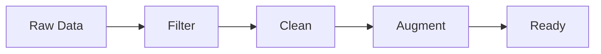

**Steps:**
1. Collect image-text pairs (e.g., LAION-5B)
2. Filter out low-quality images (resolution, blur)
3. Filter out inappropriate content
4. Clean/improve text captions
5. Resize images to consistent dimensions
6. Optionally: re-caption with a VLM (e.g., LLaVA)

**Key considerations:**

| Step | What | Why |
|------|------|-----|
| Resolution filtering | Remove images < 512px | Low-res images hurt quality |
| Aesthetic filtering | Score images for beauty | Model learns to generate beautiful images |
| Text cleaning | Fix typos, remove HTML | Better text understanding |
| NSFW filtering | Remove inappropriate content | Safety |
| Duplicate removal | Remove near-duplicates | Prevent memorization |
| Re-captioning | Generate better descriptions | Original alt-text is often poor |

```python
# Example: Basic data filtering (pseudocode)
def filter_dataset(dataset):
    filtered = []
    for image, caption in dataset:
        # Check minimum resolution
        if image.width < 512 or image.height < 512:
            continue
        # Check caption quality
        if len(caption) < 5 or len(caption) > 300:
            continue
        # Check aesthetic score
        if aesthetic_scorer(image) < 4.5:
            continue
        filtered.append((image, caption))
    return filtered
```

---

### Diffusion Architectures

Two main architectures are used for the denoising network:

#### U-Net Architecture

The U-Net is the traditional workhorse of diffusion models (used in Stable Diffusion 1.x and 2.x).

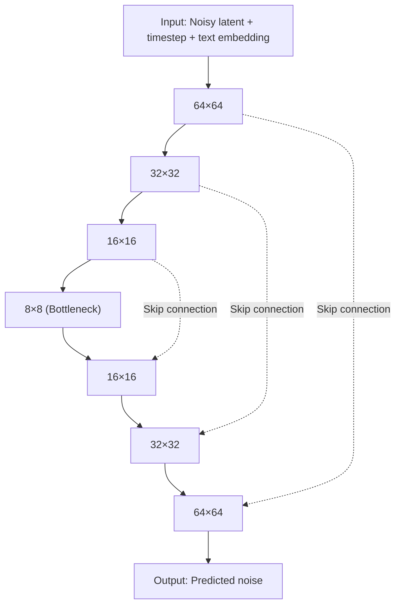

**Key features of U-Net:**
- **Skip connections:** Connect encoder layers to decoder layers (preserves fine details)
- **Cross-attention:** Text embeddings attend to image features at each level
- **Timestep embedding:** Tells the model how noisy the current image is

```python
# Simplified U-Net block (pseudocode)
class UNetBlock:
    def forward(self, x, timestep_emb, text_emb):
        # 1. Convolutional layers
        x = self.conv(x)
        # 2. Add timestep information
        x = x + self.time_mlp(timestep_emb)
        # 3. Cross-attention with text
        x = self.cross_attention(query=x, key=text_emb, value=text_emb)
        return x
```

#### DiT (Diffusion Transformer) Architecture

DiT replaces the U-Net with a Transformer — the same architecture behind GPT and BERT. This is the newer, more scalable approach (used in Stable Diffusion 3, DALL·E 3, Sora).

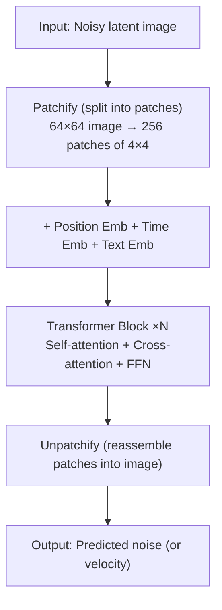

**Why DiT over U-Net?**
- Better scaling (more parameters = better results)
- Unified architecture (same as language models)
- Easier to handle multiple modalities (text + image + video)

```python
# Simplified DiT block (pseudocode)
class DiTBlock:
    def forward(self, patches, time_emb, text_emb):
        # Adaptive Layer Norm (conditions on timestep)
        scale, shift = self.adaLN(time_emb)
        x = self.norm(patches) * scale + shift

        # Self-attention (patches attend to each other)
        x = x + self.self_attention(x)

        # Cross-attention (patches attend to text)
        x = x + self.cross_attention(query=x, key=text_emb, value=text_emb)

        # Feed-forward network
        x = x + self.ffn(x)
        return x
```

---

### Diffusion Training

#### The Forward Process (Adding Noise)

The forward process gradually destroys an image by adding Gaussian noise over T timesteps.

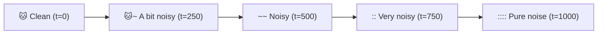

> **Math:** x_t = √(ᾱ_t) · x_0 + √(1-ᾱ_t) · ε, where ε ~ N(0, I) is random noise and ᾱ_t is a noise schedule (decreases over time)

**The noise schedule** (ᾱ_t) controls how quickly noise is added:
- At t=0: ᾱ_t ≈ 1 (almost no noise)
- At t=T: ᾱ_t ≈ 0 (pure noise)

```python
# Forward process implementation
import torch

def forward_process(x_0, t, noise_schedule):
    """
    Add noise to a clean image x_0 at timestep t.

    Args:
        x_0: Clean image [B, C, H, W]
        t: Timestep [B]
        noise_schedule: Pre-computed alpha_bar values
    """
    # Sample random noise
    epsilon = torch.randn_like(x_0)

    # Get noise level for this timestep
    alpha_bar_t = noise_schedule[t]  # Shape: [B, 1, 1, 1]

    # Create noisy image
    x_t = torch.sqrt(alpha_bar_t) * x_0 + torch.sqrt(1 - alpha_bar_t) * epsilon

    return x_t, epsilon
```

#### The Backward Process (Removing Noise / Denoising)

The backward process is what the model actually **learns**. Given a noisy image, predict the noise that was added.

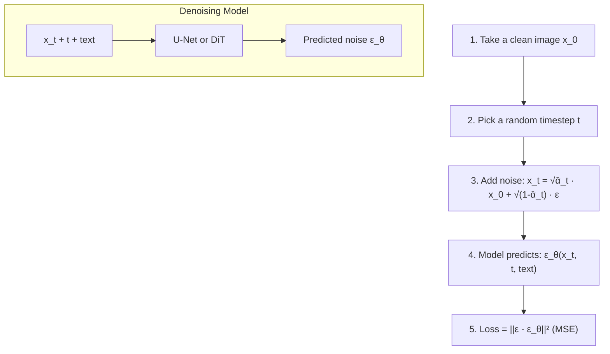

> The model learns: "What noise was added to get this noisy image at this timestep, given this text caption?"

```python
# Training loop (pseudocode)
def training_step(model, images, captions, noise_schedule):
    # 1. Encode images to latent space (using VAE encoder)
    latents = vae.encode(images)

    # 2. Encode text captions
    text_embeddings = text_encoder(captions)

    # 3. Sample random timesteps
    t = torch.randint(0, T, (batch_size,))

    # 4. Add noise (forward process)
    noisy_latents, noise = forward_process(latents, t, noise_schedule)

    # 5. Model predicts the noise
    predicted_noise = model(noisy_latents, t, text_embeddings)

    # 6. Compute loss
    loss = F.mse_loss(predicted_noise, noise)

    return loss
```

---

### Diffusion Sampling

During generation, we start from pure noise and iteratively denoise.

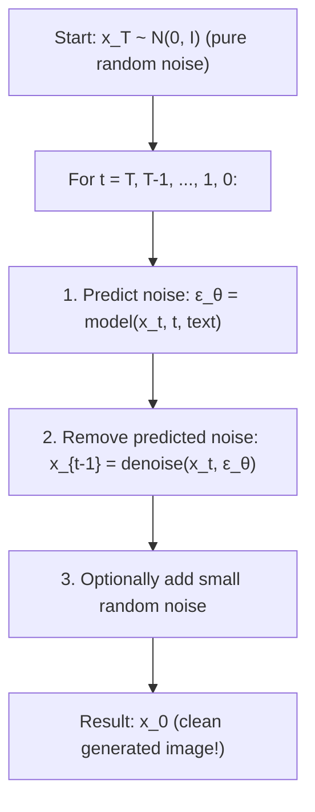

#### Classifier-Free Guidance (CFG)

CFG is a technique that improves text-image alignment at the cost of some diversity.

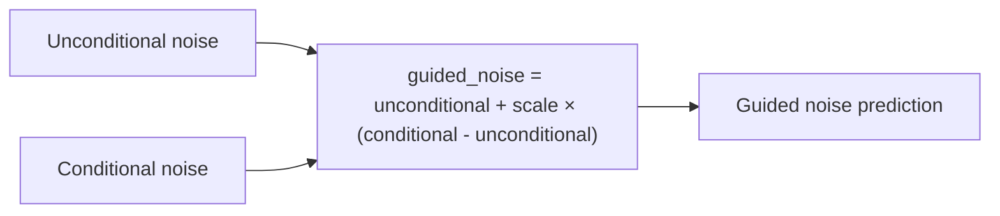

> - **guidance_scale = 1.0** → No guidance (diverse, may not match text well)
> - **guidance_scale = 7.5** → Standard (good balance)
> - **guidance_scale = 20** → Strong guidance (matches text well, but less diverse/saturated)

```python
# Sampling with classifier-free guidance (pseudocode)
def sample_with_cfg(model, text_emb, guidance_scale=7.5, num_steps=50):
    # Start from pure noise
    x = torch.randn(1, 4, 64, 64)  # Latent space

    for t in reversed(range(num_steps)):
        # Predict noise WITH text conditioning
        noise_cond = model(x, t, text_emb)

        # Predict noise WITHOUT text (unconditional)
        noise_uncond = model(x, t, null_text_emb)

        # Apply guidance: amplify the difference
        noise_guided = noise_uncond + guidance_scale * (noise_cond - noise_uncond)

        # Denoise one step
        x = scheduler.step(noise_guided, t, x)

    # Decode latent to pixel space
    image = vae.decode(x)
    return image
```

#### Common Samplers/Schedulers

| Sampler | Steps | Quality | Speed | Notes |
|---------|-------|---------|-------|-------|
| DDPM | 1000 | High | Slow | Original method |
| DDIM | 20-50 | High | Fast | Deterministic option |
| Euler | 20-30 | High | Fast | Simple, popular |
| DPM++ 2M | 15-25 | High | Fast | Good default |
| LCM | 4-8 | Good | Very fast | Distilled model |

---

### Evaluation Metrics

How do we know if a T2I model is good? We use several metrics:

**Evaluation Metrics:**

- **Image Quality** — Sharpness, Realism, No artifacts
- **Diversity** — Variety, Coverage, No repeats
- **Image-Text Alignment** — Does the image match the text prompt?

**Key metrics:** IS, FID, CLIP Score

#### Inception Score (IS)

Measures **quality** and **diversity** using a pre-trained classifier.

```
IS = exp(E[KL(p(y|x) || p(y))])

High IS = 
  ✓ Each image clearly belongs to ONE class (quality)
  ✓ Different images belong to DIFFERENT classes (diversity)

Typical values:
  Real images (ImageNet): ~250
  Good generative model: 50-200
  Poor model: < 10
```

#### Fréchet Inception Distance (FID)

Measures how similar the **distribution** of generated images is to real images.

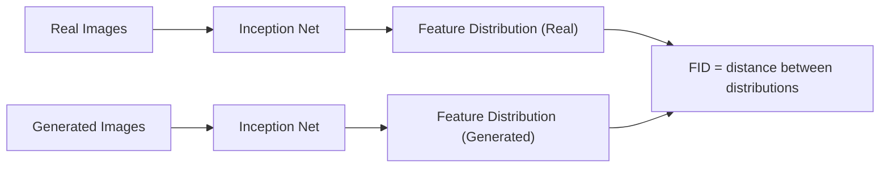

> - **FID = 0**: Perfect (identical distributions)
> - **FID < 10**: Excellent
> - **FID 10–50**: Good
> - **FID > 50**: Poor
>
> Lower FID = Better (generated ≈ real)

#### CLIP Score

Measures how well the generated image matches the input text prompt.

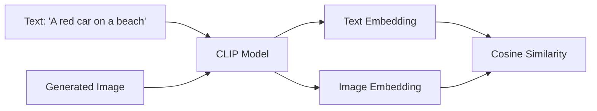

> CLIP Score = cosine_similarity(text_emb, image_emb)
>
> Higher = Better alignment between text and image. Typical range: 0.25–0.35 for good models.

```python
# Computing CLIP Score (pseudocode)
from transformers import CLIPModel, CLIPProcessor

def compute_clip_score(images, prompts):
    model = CLIPModel.from_pretrained("openai/clip-vit-large-patch14")
    processor = CLIPProcessor.from_pretrained("openai/clip-vit-large-patch14")

    inputs = processor(text=prompts, images=images, return_tensors="pt")
    outputs = model(**inputs)

    # Cosine similarity between text and image embeddings
    clip_score = outputs.logits_per_image.diagonal()
    return clip_score.mean()
```

---

## Text-to-Video (T2V)

Text-to-video extends text-to-image by adding the **temporal dimension** — generating coherent sequences of frames.

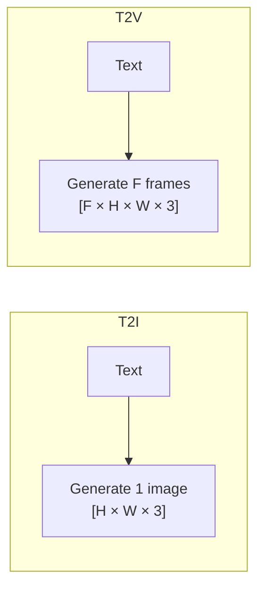

> **Challenge:** Frames must be individually high-quality, temporally consistent (smooth motion), and physically plausible (objects move naturally).

### Latent Diffusion Modeling (LDM) and Compression Networks

Videos are HUGE. A 5-second video at 30fps and 1080p = 5 × 30 × 1920 × 1080 × 3 ≈ 933 million values! We must compress before diffusing.

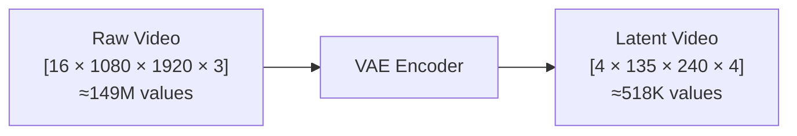

> **Compression ratio: ~288×!** The VAE compresses spatially (8× in height and width), temporally (4× in frames), and channels (3 RGB → 4 latent channels).

**3D VAE for Videos:**

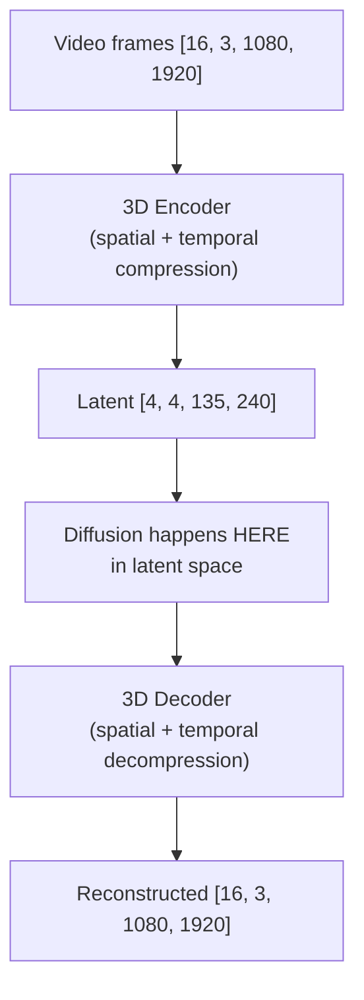

---

### Data Preparation for Video

Video data preparation is more complex than images.

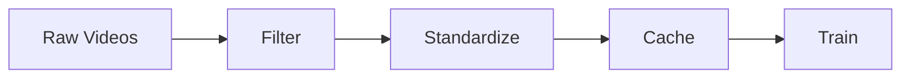

**1. Filtering:**
- Remove static/frozen videos
- Remove overly fast/chaotic motion
- Filter by aesthetic quality per frame
- Remove watermarked content
- Scene detection (split at cuts)
- Optical flow analysis (motion quality)

**2. Standardization:**
- Fixed FPS (e.g., 24 fps)
- Fixed resolution (e.g., 720p or 1080p)
- Fixed duration (e.g., 2–10 seconds)
- Aspect ratio bucketing

**3. Video Latent Caching:**
- Pre-encode all videos through 3D VAE
- Store latent representations on disk
- Avoids re-encoding during training (saves GPU time)
- Also cache text embeddings

```python
# Video data preparation (pseudocode)
def prepare_video_dataset(raw_videos):
    processed = []

    for video in raw_videos:
        # 1. Scene detection - split at cuts
        scenes = detect_scenes(video)

        for scene in scenes:
            # 2. Filter
            if scene.duration < 2.0 or scene.duration > 10.0:
                continue
            if compute_motion_score(scene) < 0.1:  # Too static
                continue
            if detect_watermark(scene):
                continue

            # 3. Standardize
            scene = resize(scene, height=720)
            scene = resample_fps(scene, target_fps=24)
            scene = crop_to_aspect_ratio(scene, ratio=16/9)

            # 4. Cache latents
            latent = video_vae.encode(scene)
            text_emb = text_encoder(scene.caption)
            save_to_disk(latent, text_emb)

            processed.append(scene)

    return processed
```

---

### DiT Architecture for Videos

The video DiT extends the image DiT by adding **temporal attention** — allowing the model to understand motion and change over time.

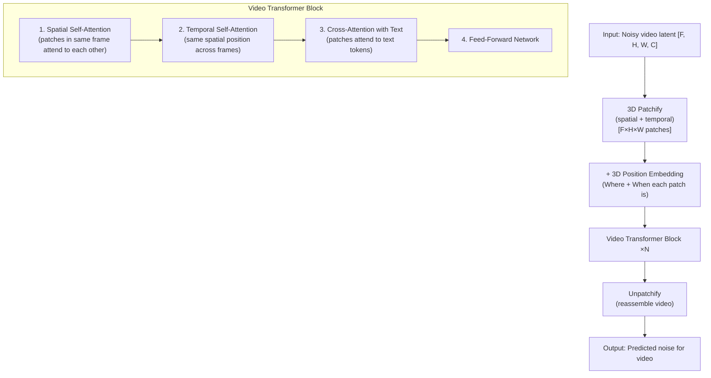

**Factorized attention** is key — instead of having all patches attend to all other patches (which would be computationally impossible for videos), we separate spatial and temporal attention:

**Factorized Attention**

Consider a grid of patches across 3 frames:

| | Pos A | Pos B | Pos C |
|---|---|---|---|
| **Frame 1** | A1 | B1 | C1 |
| **Frame 2** | A2 | B2 | C2 |
| **Frame 3** | A3 | B3 | C3 |

- **Spatial attention** (within each frame): A1 ↔ B1 ↔ C1, A2 ↔ B2 ↔ C2, A3 ↔ B3 ↔ C3
- **Temporal attention** (across frames): A1 ↔ A2 ↔ A3, B1 ↔ B2 ↔ B3, C1 ↔ C2 ↔ C3

This is **much cheaper** than full 3D attention: Full O(F²×H²×W²) vs Factorized O(F² + H²×W²)

---

### Large-Scale Training Challenges

Training T2V models is extremely resource-intensive.

#### Challenge 1: Compute
- Sora-class models: 1000s of GPUs for weeks
- Single video = 100× more computation than single image
- **Solution:** Progressive training (low-res → high-res)

#### Challenge 2: Memory
- Video latents are huge even after compression
- **Solution:** Gradient checkpointing, mixed precision, sequence parallelism

#### Challenge 3: Data
- Need millions of high-quality video-text pairs
- Video captioning is harder than image captioning
- **Solution:** VLMs for auto-captioning, synthetic data

#### Challenge 4: Temporal Consistency
- Flickering, objects disappearing between frames
- **Solution:** Temporal attention, motion conditioning, progressive temporal training

#### Challenge 5: Evaluation
- Image metrics don't capture motion quality
- **Solution:** FVD (Fréchet Video Distance), human eval

**Progressive training strategy:**

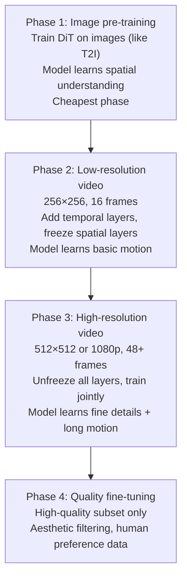

---

### T2V Overall System

Here's how all the pieces fit together:

```mermaid
graph TD
    subgraph Inference Pipeline
        Prompt["'A golden retriever playing in snow'"] --> TextEnc["Text Encoder (T5 / CLIP)"]
        TextEnc --> TextEmb["Text embeddings"]
        Noise["Random noise [F×H×W×C]"] --> DiT["Video DiT<br/>Iterative Denoising<br/>(20–50 steps)"]
        TextEmb --> DiT
        DiT --> Denoised["Denoised latent [F'×H'×W'×C]"]
        Denoised --> VAEDec["3D VAE Decoder"]
        VAEDec --> Video["Video frames [F×H×W×3]"]
    end
    subgraph Training Pipeline
        Dataset["Video Dataset"] --> DataPrep["Data Prep"]
        DataPrep --> LatentCache["Latent Caching"]
        LatentCache --> Train["Train"]
        Train --> Loss["Loss = MSE(predicted_noise, actual_noise)<br/>Distributed across 100s–1000s of GPUs"]
    end
```

---

## Glossary

| Term | Definition |
|------|-----------|
| **Attention** | Mechanism that allows a model to focus on relevant parts of the input |
| **Auto-regressive** | Generating output one piece at a time, each dependent on previous pieces |
| **CFG (Classifier-Free Guidance)** | Technique to improve text-image alignment by amplifying conditional signal |
| **CLIP** | Model that understands both images and text in a shared embedding space |
| **Cross-attention** | Attention between two different sequences (e.g., image features ↔ text) |
| **Denoising** | The process of removing noise from a noisy signal |
| **Diffusion model** | Generative model that learns to reverse a noise-adding process |
| **DiT** | Diffusion Transformer — uses transformer architecture for denoising |
| **Embedding** | A numerical vector representation of data (text, image, etc.) |
| **Encoder** | Network that compresses input into a smaller representation |
| **Decoder** | Network that reconstructs output from a compressed representation |
| **Epoch** | One complete pass through the training dataset |
| **FID** | Fréchet Inception Distance — measures realism of generated images |
| **Forward process** | Adding noise gradually to a clean image (during training) |
| **GAN** | Generative Adversarial Network — generator vs. discriminator |
| **Gaussian noise** | Random noise following a bell curve (normal) distribution |
| **Guidance scale** | How strongly the text prompt influences generation (higher = more) |
| **IS (Inception Score)** | Measures quality and diversity of generated images |
| **Latent space** | Compressed representation space where generation happens |
| **LDM** | Latent Diffusion Model — diffusion in compressed latent space |
| **Loss function** | Mathematical measure of how wrong the model's predictions are |
| **MSE** | Mean Squared Error — average of squared differences |
| **Noise schedule** | How noise levels change across timesteps |
| **Patch** | A small square region of an image (used in Transformers) |
| **Reverse process** | Removing noise step by step to generate an image |
| **Sampler/Scheduler** | Algorithm that defines the denoising steps during generation |
| **Self-attention** | Attention within a single sequence (elements attend to each other) |
| **Skip connection** | Direct connection that bypasses layers (preserves information) |
| **T2I** | Text-to-Image generation |
| **T2V** | Text-to-Video generation |
| **Temporal** | Relating to time (the time dimension in video) |
| **Timestep** | Current position in the noise schedule (0=clean, T=noise) |
| **Token** | A discrete unit (word piece for text, patch for images) |
| **U-Net** | CNN architecture with encoder-decoder and skip connections |
| **VAE** | Variational Autoencoder — compresses data to/from latent space |
| **VLM** | Vision-Language Model — understands both images and text |

---

## Further Reading

1. **Papers:**
   - "Denoising Diffusion Probabilistic Models" (Ho et al., 2020)
   - "High-Resolution Image Synthesis with Latent Diffusion Models" (Rombach et al., 2022)
   - "Scalable Diffusion Models with Transformers" (Peebles & Xie, 2023)
   - "VideoPoet" (Google, 2023)

2. **Code:**
   - Hugging Face Diffusers: https://github.com/huggingface/diffusers
   - Stable Diffusion: https://github.com/Stability-AI/stablediffusion

3. **Courses:**
   - Hugging Face Diffusion Models Course
   - fast.ai Practical Deep Learning

---

*Next: See [PROJECT.md](./PROJECT.md) for the hands-on tutorial to build your own Multi-modal Generation Agent!*
